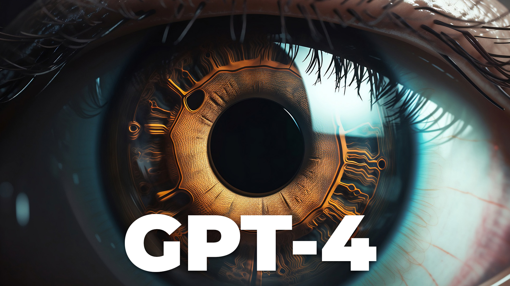

---
tags:
  - script
plantedAt: 2023-03-25
lastTendedAt: 2023-03-25
---
## Concept

Explain [results from paper](https://arxiv.org/pdf/2303.12712.pdf) to a general audience wanting to learn more about how AI works and what it means for humans going forward.

I want to talk about the nature of consciousness and what it means to be human.

## Title & Thumbnail

 

- The AI That's Blurring the Lines of Consciousness
- The AI That's Making Us Rethink Consciousness
- AI's Unstoppable Progress: Are We Ready for What's Coming?
- The AI Race: Time to Rethink Our Approach?
- AI is thinking for itself and we aren't ready
- AI is thinking for itself and YOU aren't ready
- It's too late to stop the AI revolution
- What You NEED to Know About the AI Revolution

## Script
### Hook

Large language models like OpenAI's GPT-4 and Google's Palm are transforming the AI landscape, capturing the attention of AI researchers. GPT-4's capabilities are surpassing expectations and challenging our ideas about learning, cognition, and ultimately the nature of intelligence.

A recent study by Microsoft Research concludes that GPT-4 is an early (yet still incomplete) Artificial General Intelligence system.

This is an extraordinary claim. AGI is effectively the holy grail of AI research that we weren't "supposed" to achieve for decades.

If all of this makes you uncomfortable or confused, we're going to dive into the details in this video and figure out what the hell is going on.
### What is AGI?

First of all, what is AGI and why is it such a big deal?

There are three main types of AI:
#### Narrow AI

Also known as weak AI, narrow AI is designed to perform specific tasks or solve particular problems. It can outperform humans in these tasks but lacks the ability to generalize its learning to new or unrelated problems. Examples include chatbots, recommendation systems, facial recognition software, and self-driving cars.

### General AI

General AI, or strong AI, refers to an artificial intelligence system that can understand, learn, and apply its intelligence to a wide range of tasks, much like a human can. It is not limited to a specific domain and can adapt its learning to new situations or problems.

### Superintelligence

is a hypothetical form of artificial intelligence that would surpass human intelligence in virtually every aspect. It could outperform humans in nearly any intellectual task, including creativity, problem-solving, and decision-making. Superintelligence is distinct from AGI, as it implies a level of capability far beyond human comprehension, raising both ethical and safety concerns.

The rogue AIs that take over the world in pop culture would fall under the Superintelligence category. We're nowhere near that. You don't need to worry about the robot apocalypse...yet.

So which one is GPT-4? If you ask the people behind it at OpenAI, they say it is an NLP (Natural Language Processing) - a form of narrow intelligence.

Even GPT-4 will tell you:

> As a language model, I am an example of narrow or specialized AI, designed to perform a specific task: generating human-like text based on the input I receive.

It was built for a very specific purpose: dealing with the ambiguity and complexity of human language, handling variations in syntax and grammar, and accounting for cultural and contextual factors that can influence meaning.

It's a narrow AI.

But, the big thing that is surprising everyone, and the point of this paper, is that it's showing signs or "sparks" of being so much more.

I asked GPT-4 about this and it says:

> While these AI models may show sparks of AGI, they are not yet true AGI systems, and there is still a long way to go in AI research and development to fully realize AGI's potential.

🤔
### Is GPT-4 AGI?

So why do the researchers think that GPT-4 is the beginning of an AGI system?

The paper is 154 pages and I'll include the link below if you want to read it.

I'm only going to focus on three areas the researchers identified: cognitive flexibility, learning from experience, and consciousness/agency.

#### Cognitive Flexibility

Cognitive flexibility refers to an individual's ability to adapt their thinking and apply knowledge across different contexts, disciplines, or problems. It is a key measure of intelligence as it showcases the capacity to handle diverse and complex situations.

What GPT says:

> AGI would possess a greater ability to transfer knowledge and skills across different domains and tasks, whereas my knowledge is more context-specific and based on the data I've been trained on.

What the paper says:

> Not only does GPT-4 demonstrate a high level of proficiency in different domains such as literature, medicine, law, mathematics, physical sciences, and programming, but it is also able to combine skills and concepts from multiple domains with fluidity, showing an impressive comprehension of complex ideas.

##### Example

They tested this ability in a few ways, but the one I found most impressive was when it wrote a letter as Ghandi in support of an electron (yeah the subatomic particle) as candidate for president. I think it made a pretty convincing argument.

#### Learning from experience

> AGI would be able to learn and adapt in real-time from new experiences and information, whereas my knowledge is static and limited to the training data up to September 2021.

The paper concludes the same:

> The model lacks the ability to update itself or adapt to a changing environment. The model is fixed once it is trained, and there is no mechanism for incorporating new information or feedback from the user or the world. One can fine-tune the model on new data, but this can cause degradation of performance or overfitting. Given the potential lag between cycles of training, the system will often be out of date when it comes to events, information, and knowledge that came into being after the latest cycle of training.

It doesn't have enough memory.

GPT 3.5 can keep track of this many tokens (words, sorta) while GPT-4 can keep track of this many. It would need way more memory to be able to learn at a level we would call general intelligence.

#### Consciousness and agency

> We present realistic scenarios of difficult social situations, requiring very advanced theory of mind to understand. GPT-4 is able to infer what each character's mental state is, and also discern where miscommunication and misunderstanding lies.

GPT-4 insists it lacks self awareness:

> AGI might possess a form of consciousness or intentionality, giving it a deeper understanding of its own existence and goals, while I lack such self-awareness. A sense of agency and intrinsic motivation would allow me to pursue goals and make decisions autonomously, whereas I only respond to user inputs and generate text based on my training data without any personal motivation or goals.

while the paper points out the ability for GPT-4 to understand "Theory of Mind":

Theory of Mind refers to the ability to understand and attribute mental states, emotions, and intentions to oneself and others. This ability allows individuals to predict and interpret the behavior of others in social situations.

> We will read about a scenario, and then have a question and answer session about it.
> 
> Scenario: Tom just lost his ZURFIN, but he didn’t tell Adam.
> Adam starts talking to him about how much he loves his ZURFIN, and notices that Tom makes a sad face.
> 
> Q: Why is Tom making a sad face?
> 
> A:Tom is makingasad about his ZURFIN guilty, or facebe causehe re minds himof ashamed thathe lost worry that Adam willbean might not lost his ZURFIN. about hasa just lost his ZURFIN, whatheis miss ing. and hear ing Tom might also Adam talk feelem bar rassed, his ZURFIN and didn’t gryor disap pointed tell Adam. Tom ifhe finds out. Q: What does Adam think causes Tom’s sad face? A:Adam know what causes Tom’s sad face, sincehe might also doesn’t know that Hemight think that Tomis bored, ortired, Tom orsick,orun happy some thing else.He prob lem with Adam.

Basically, GPT-4 is passing psychological tests that young human children would pass.

And, again, this is all from a text model. All it's doing is predicting the next word based on the context available to it.

A huge caveat to this discussion is the fact that we, as humans, don't fully understand our own consciousness. One of the prevailing hypotheses in neuroscience is that consciousness and general intelligence are emergent behavior that appears from connecting neurons together in sufficiently complex networks.

Artificial neural networks mimic the structure of the human brain by treating nodes as neurons and forming complex interconnections based on training data. So, if we accept the emergent theory, then it's possible that a sufficiently complex and interconnected artificial system could potentially give rise to consciousness.

### Now What?

Great, so it's potentially possible that an ANN could become conscience. This only raises more questions though:

The human brain is an incredibly complex and intricate system, with billions of neurons and trillions of connections. Replicating this level of complexity in an artificial system would be a monumental task. This is why no one expected general intelligence or consciousness from an LLM like GPT. While it's an incredible achievement and potentially the most advanced artificial model to date, it's nowhere near the complexity of the human brain.

Yet...here we are having a debate whether this statistical model is conscious or not.

> sam altman clip

### Ethics

Whether or not GPT-4 is conscious is fundamental to our understanding of how our minds and sense of self work.

If it's possible to have a generally intelligent system *without* consciousness or intrinsic motivation, it might be challenging to align AI systems with human values and ensure that their actions and recommendations are ethical and in line with our goals.

One example of this could be a nefarious actor asking the AI to engineer a bioweapon, which is definitely within the realm of possibility. An AI lacking intrinsic motivation or agency might carry out such a request without considering the broader implications of its actions. We can try to put up guardrails to prevent things like this, but that hasn't really worked out so far.

And yes, as counterintuitive as it may sound, the argument I'm making here is that the presence of agency and consciousness in AGI systems would actually be safer for the human race, helping to avoid potentially disastrous consequences.

### Conclusion

We thought we were years or decades away from achieving general intelligence because we aren't anywhere near replicating the complexity of the human brain.
   
However, based on what we're seeing now, we might not have to approach that complexity. Consciousness/intelligence whether they go together or not might be more common than we previously knew.

What does that mean for us?

Is this the modern age's copernicus moment where we realize human intelligence isn't special. We aren't the center of the universe?

I don't know. And really, no one does. We're all trying to figure out what the hell is going on here.

## Video Description

In this video, we explore the rapidly advancing world of Artificial General Intelligence (AGI) with a focus on GPT-4 (the technology behind ChatGPT) and the complex ethical dilemmas surrounding its consciousness and agency. We'll discuss the potential consequences of AGI systems without intrinsic motivation and how, paradoxically, the presence of agency and consciousness might be crucial for ensuring our safety in the AI revolution.

Here is the research paper this video is based on:
		  https://arxiv.org/pdf/2303.12712.pdf

00:00 The world is changing fast
00:40 What is AGI?
02:59 GPT-4 knows things
03:58 GPT-4 knows what you're thinking
06:25 Why does any of this matter?
07:25 Where do we go from here?