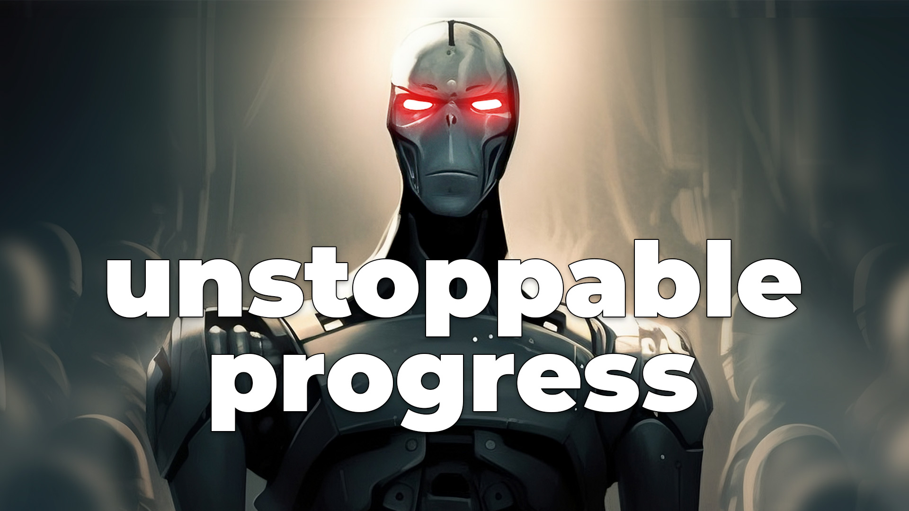
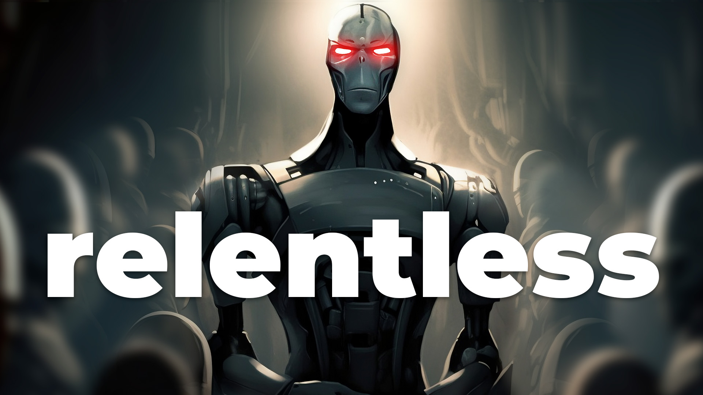
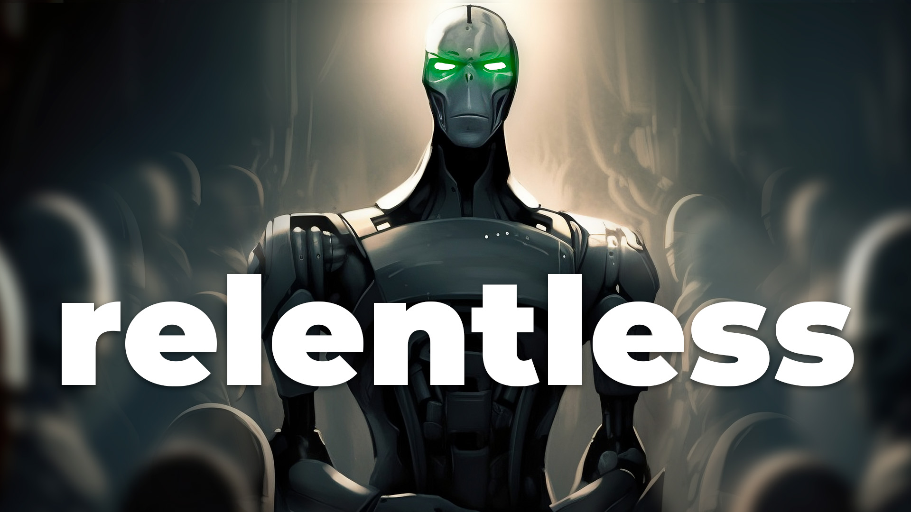
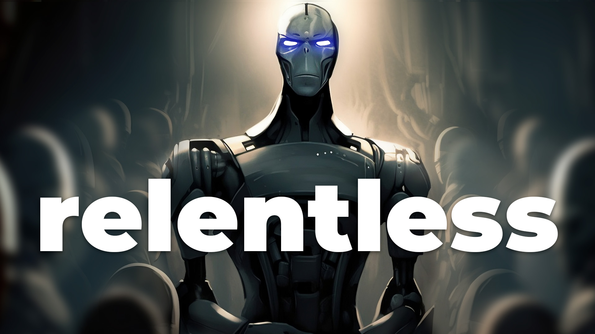

---
tags:
  - script
plantedAt: 2023-04-04
lastTendedAt: 2023-04-04
---
## Concept

Explain the amazing achievements of GPT-4 and why AI experts want to stop its progress.

I want people to know what's happening so we all have a say in our future.

## Title & Thumbnail

   

- How do we ensure safety while harnessing INCREDIBLE power?
- Can Humanity Effectively Harness INCREDIBLE Power?
- Humanity's Final Countdown: Can We Change the Outcome?
- Where Do We Draw the Line on AI Development?
## Script/Outline
		- #### Hook
			- > the first time you fail at aligning something much smarter than you are, you die.
			- There's been a lot of doom and gloom surrounding AI lately especially from experts in the field.
			- [An open letter](https://futureoflife.org/open-letter/pause-giant-ai-experiments/) was released last week that calls on world governments to issue a moratorium on training Artificial Intelligence models more powerful than GPT-4 because "Advanced AI could represent a profound change in the history of life on Earth."
				- Wow, that seems pretty dramatic.
			- So what's the deal, why are all the smart people yelling at us?
			- In this video, we'll discuss the concerns surrounding AI alignment, the progress of GPT-4, and the debate on whether to halt the development of even more advanced AI models like GPT-5.
		- #### GPT-WTF
			- First of all, we're talking about GPT-4 here. This is the Large Language Model that powers apps like ChatGPT and Bing's newly released search assistant.
			- But the version of GPT-4 in each of those apps is a different flavor of the model. It can be given different "system instructions" in each of those apps and in Bing's case, it's limited in how long it will let a conversation get before terminating it.
			- Scientists and researchers working on GPT-4, on the other hand, are using the raw, unfiltered model to do their research. And the things they are finding it is capable of are beyond our expectations from a model like this.
			- Not only that, there is exciting research in getting more out of GPT-4 by combining it with other narrower intelligence models for computer vision, stable diffusion, even long-term memory.
				- One metaphor that might make that easier to understand is to think of GPT-4 kind of like a prefrontal cortex, handling logic and reason while delegating other specific tasks like vision and even imagination to specialized areas of its brain.
			- This has led to some even more impressive results showing that GPT-4 can improve its intelligence level on its own using a Reflexion learning technique.
				- > we are past the point where in science fiction people would be like whoa wait stop that thing's alive. what are you doing to it?
		- #### Alignment
			- A potentially generally intelligent system with consciousness and agency has the potential to change our world in amazingly positive ways. These are just some of the ways we are capable of imagining right now:
				- Accelerated scientific discovery
				- Medical advancements
				- Climate change mitigation
				- Enhanced education
				- Poverty reduction
				- Automation of labor: freeing up human labor for more creative, fulfilling, and valuable pursuits
				- Enhanced space exploration
			- And if we are able to build an intelligence smarter than us (a superintelligence), the possibilities are endless.
			- But only if it's aligned.
				- Alignment is a specific term that AI researchers use to describe the process of ensuring that an artificial intelligence system, particularly an advanced one like AGI, behaves in a way that is consistent with human values.
			- > I think there was an intuition like two years ago even that something like GPT-4, the current capabilities of even ChatGPT with GPT-3.5, is we're still far away from that. I think a lot of people are surprised by the capabilities of GPT-4 right so now people are waking up okay we need to study these language models.
			- AI Alignment is a topic that spans multiple fields of discipline including computer science, neuroscience, psychology, and philosophy.
			- It's a very difficult thing to get right and we don't fully know *how* to get it right just yet. Given the exponential pace of development that is happening right now, a lot of research needs to happen real fast.
				- > are Earth's billionaires going to put up like the the giant prizes that would maybe incentivize young hot shot people who just got their physics degrees to not go to the hedge funds and instead put everything into interpretability in this like one small area where we can actually tell whether or not somebody has made a discovery or not
		- #### GPT-5
			- As GPT-3.5 and GPT-4 are already beginning to circulate through world economies, we are discovering that it's capable of things we didn't expect.
			- We might have unlocked the key to intelligence with a relatively simple algorithm of stacking transformer layers. In other words, we can potentially create smarter and smarter systems by just throwing more hardware at it.
				- This is hotly debated right now. We don't know if we're going to hit a limit on intelligence levels from continuing to build on this technique, but we, as a species, are certainly trying.
			- OpenAI released a statement saying:
				- > At some point, it may be important to get independent review before starting to train future systems, and for the most advanced efforts to agree to limit the rate of growth of compute used for creating new models.
			- 7900 people (and growing) have signed the open letter saying "That point is now" calling for no training runs larger than GPT-4 for at least six months.
			- Rumors have circulated that [GPT-5 is being trained right now](https://www.reddit.com/r/ChatGPT/comments/11v3os0/we_think_that_gpt5_is_currently_being_trained_on/) on 25k GPUs and will be ready by December. OpenAI hasn't made any public statements about it as of this recording.
			- And some people within OpenAI believe GPT-5 will achieve AGI, for at least some definition of that term.
			- If you agree with experts and think we should pause on training larger models than GPT-4 for now, you could sign the letter too. I'll leave a link in the description.
			- We can enjoy a long AI summer and take our time integrating GPT-4 into our society while we do the critical research necessary to ensure humanity's safety. But only if people are paying attention to what's going on and participating in the conversation of humanity's destiny.
			- If your still fuzzy on the details and you want to know exactly what's at stake from failing to align a generally intelligent system, along with how a potential moratorium on large training runs could be enforced world-wide, especially with recent leaks of LLMs from large tech companies, you should watch this video next.
	- ### Video Description
	  collapsed:: true
		- In this video, we discuss the importance of AI alignment as we explore the potential of AGI and the capabilities of GPT-4, the powerful language model behind ChatGPT. We delve into the challenges of aligning artificial intelligence with human values, the implications for society, and the ongoing debate on the future development of AI technologies.
		- Open Letter: https://futureoflife.org/open-letter/pause-giant-ai-experiments/
		  Signed by (among others):
		- Yoshua Bengio, Founder and Scientific Director at Mila, Turing Prize winner and professor at University of Montreal
		- Stuart Russell, Berkeley, Professor of Computer Science, director of the Center for Intelligent Systems, and co-author of the standard textbook “Artificial Intelligence: a Modern Approach"
		- Elon Musk, CEO of SpaceX, Tesla & Twitter
		- Steve Wozniak, Co-founder, Apple
		- Yuval Noah Harari, Author and Professor, Hebrew University of Jerusalem.
		- Emad Mostaque, CEO, Stability AI
		- Andrew Yang, Forward Party, Co-Chair, Presidential Candidate 2020, NYT Bestselling Author, Presidential Ambassador of Global Entrepreneurship
		- John J Hopfield, Princeton University, Professor Emeritus, inventor of associative neural networks
		- Valerie Pisano, President & CEO, MILA
		- Connor Leahy, CEO, Conjecture
		- ---
		- Research referenced in this video:
		  https://arxiv.org/pdf/2303.11366.pdf
		  https://arxiv.org/pdf/2210.11610.pdf
		  https://arxiv.org/pdf/2303.17580.pdf
		- Rumors:
		  https://twitter.com/blader/status/1640217165822578688
		  https://www.reddit.com/r/ChatGPT/comments/11v3os0/we_think_that_gpt5_is_currently_being_trained_on/
		- Full interview with Eliezer Yudkowsky:
		  https://youtu.be/AaTRHFaaPG8
		- 00:00 Why all the yelling?
		  00:42 GPT-WTF
		  01:49 Alignment
		  03:09 GPT-5
		  04:30 Sign the letter
	- ### Result
		- {{video https://youtu.be/3HcgQ7-jw2M}}