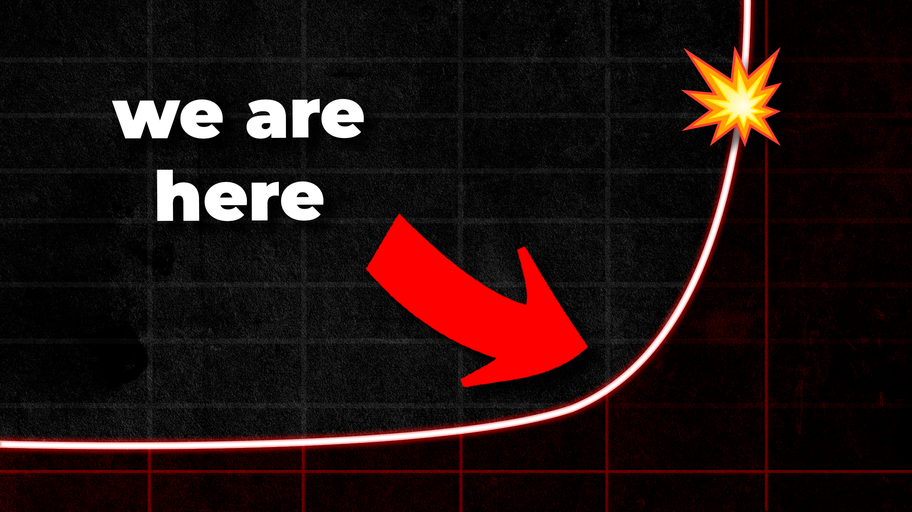
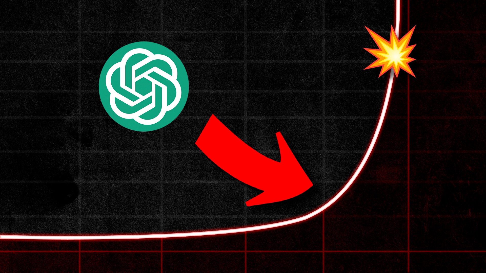
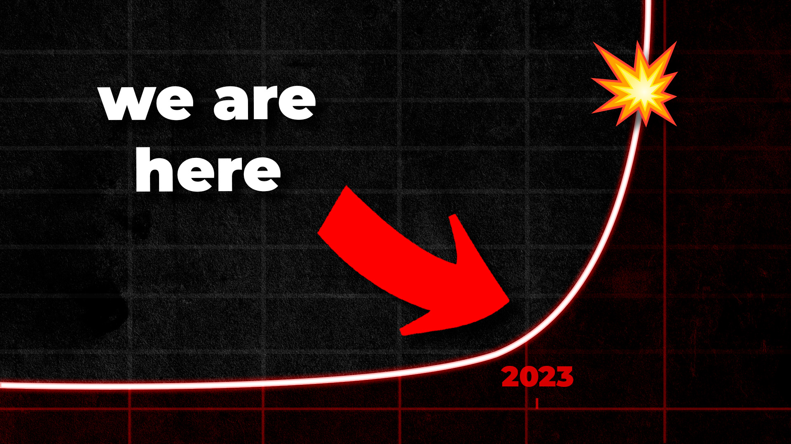
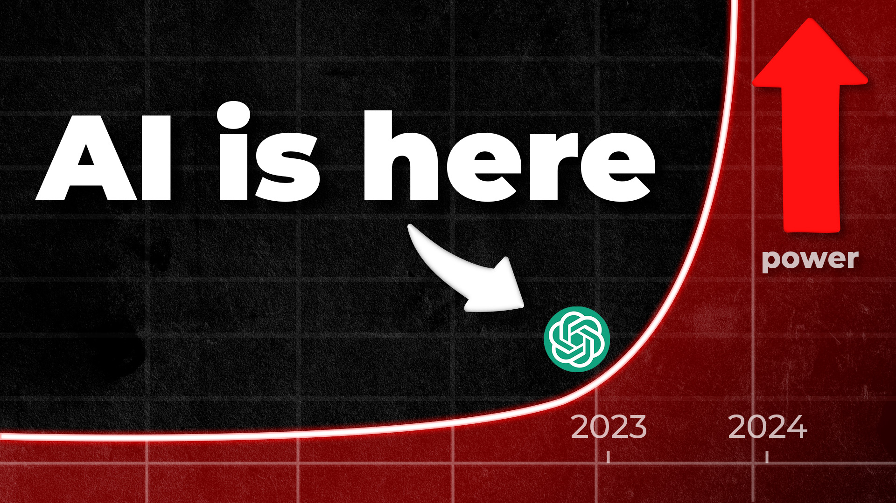
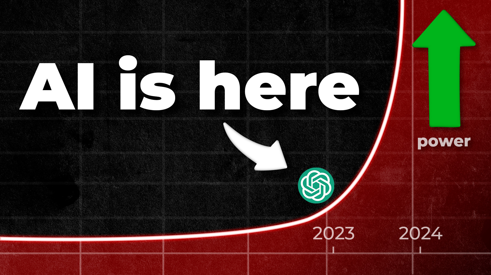

- ## AI Religion
	- tags:: [[Mindful Machines]]
	  type:: video
	  published:: false
	- ### Concept
		- Explore the parallels between religion and the transhumanism ideas about AI apocalypse
	- ### Title & Thumbnail
	- ### Script
		- #### Hook
		- #### Conclusion
	- ### Video Description
	- ### Result
- ## [[YouTube]]
	- {{video https://youtu.be/jk2aUz00_AY}}
		- {{youtube-timestamp 101}} AI apocalyptic futures mirror ancient Jewish/Christian texts
		- {{youtube-timestamp 132}} digital Armageddon vs new virtual kingdom
		- {{youtube-timestamp 175}} apocalypse: uncovering or revealing
		- {{youtube-timestamp 220}} apocalypse is the "remaking of the world"
		- {{youtube-timestamp 225}} technical definition of apocalypticism:
			- id:: 6457bf12-d5c5-4f7d-a2cf-4e13b3f95e73
			  > A worldview that anticipates the imminent end of the present age - an age ruled by corrupt and evil powers. However, a new era is upon us during which we will witness the overthrow of the present age, the transformation of the world, and the inauguration of God's rule.
		- {{youtube-timestamp 300}} "it's going to happen any day"
		- {{youtube-timestamp 336}} new heaven, new earth
		- {{youtube-timestamp 348}} current world of clay, next world is world of gold
		- {{youtube-timestamp 359}} god transforms humans into immortal beings with glorified bodies
		- {{youtube-timestamp 415}} Apocalyptic AI: secular analog to religious apocalypticism
		- {{youtube-timestamp 587}} Charles Stross (2008):
		  id:: 6457c40b-6b21-4927-b032-0c8e42335a9d
			- > Yes, trust in the inevitability of a Singularity can be a religious belief, however unlike most religions, it's based on a prophecy that may actually be true.
			- > I think it's far more likely that I will one day be able to upload my consciousness into a virtual construct of my own liking for all eternity, than that if I die, I will go to heaven.
		- {{youtube-timestamp 683}} Transhumanism: phase out suffering and eliminate unpleasant experiences in sentient beings
		  id:: 6457c95a-ea30-444d-a9d4-100b6d52ca96
- ## Intelligence Explosion
  id:: 6456b35a-071b-4fab-9d07-f71b42cb59e4
	- tags:: [[Mindful Machines]]
	  type:: video
	  published:: true
	- ### Concept
		- I talk about what an intelligence explosion is, transhumanism, hard and soft take-offs.
		- also talk about why it's so hard to notice exponential growth
		- It ends with the message: alignment is how you solve the inevitable intelligence explosion
	- ### Thumbnail
		- 
		- 
		- 
		- 
		- 
	- ### Title
		- How to SURVIVE an Intelligence Explosion
		- Intelligence Explosion SURVIVAL Guide
	- ### Script
		- #### Hook
			- An intelligence explosion happens when an intelligent agent gains the ability to self-improve leading to rapid and unstoppable increases in its ability.
			- This idea definitely feels like it's something straight out of a sci-fi movie.
			- But it's a scenario taken seriously by AI experts like Geoffrey Hinton, the godfather of AI. He left his post last week as engineering fellow at Google so that he could freely warn people about the imminent and existential dangers of AI.
			- So what do we do about this? Should I go buy a shotgun and a leather jacket to protect myself from terminators?
				- I mean, I probably shouldn't. I don't know how to use a freakin shotgun.
				- I mean, maybe if I could control the shotgun with wasd and a mouse, I might fare a little better in a mad max hellscape.
			- Just to get one thing out of the way, predicting the future is extremely difficult. And just because a bunch of smart and serious people say something, doesn't mean it's actually going to come to fruition.
				- There other voices out there that are much more comforting. So if you want to just feel good about life and continue living as if nothing is happening, you shouldn't watch the rest of this video.
					- cypher: ignorance is bliss clip
				- Maybe go watch the latest marvel movie or something.
					- ynotboth meme
			- So let's dive into this. Why are the AI experts raising alarm bells right now and making extraordinary claims about apocalyptic scenarios?
		- #### Apocalypse Now
			- The word "apocalypse" means a lot of things to different people, but most people view it as "the end of the world" but it is actually more nuanced.
				- It comes from the greek word "ἀποκάλυψις" which means "revelation":
					- > an unveiling or unfolding of things not previously known and which could not be known apart from the unveiling
				- Dr. Andrew Henry, a scholar of religious studies, gives a technical definition of apocalypticism:
					- ((6457bf12-d5c5-4f7d-a2cf-4e13b3f95e73))
						- Honestly, that does sound kind of nice right now. I definitely see why the idea of apocalypse has resonated with humans throughout the ages.
			- Apocalypticism is an idea as old as time itself.
			- Throughout human history, we have told each other stories of the coming transformation: the imminent rise of god's kingdom to right all the wrongs and bring immortality to a select few while the rest of us here...I don't know, die I guess.
			- AI Apocalyptic scenarios often feature very similar secular versions of the same thing.
			- An Artificial Superintelligence would be able to see the fabric of the universe that we are unable to see and usher in a utopia for humanity - at least in the case of an aligned AI.
			- The other side of the coin, is that a superintelligence, not aligned with human values, might treat us the same way we treat wild animals.
				- I mean, most of us don't try to hurt animals, but we support a system that very much does. Our society treats entities that we view as "lower intelligence" kind of like shit. We support a system that will casually destroy animal habitats because, ya know, we have goals. Gotta build that new subdivision of cookie cutter housing. Fuck those squirrels, they can go find another tree.
			- But either way, utopia or dystopia, AI Apocalypticism speaks to imminent and drastic change to the current order.
			- Given this new context, a more accurate view of the AI Apocalypse might be "the remaking of the world."
			- This worldview often comes about amid times of intense social or political change, liminal moments in time, where people feel anxious and alienated.
				- The idea that an all powerful being is coming at any moment to transform the world and usher in a utopian or dystopian future (depending on which flavor of apocalypse you like). It's an idea as old as time.
		- #### Superintelligence
			- George Hinton is a pioneer in deep learning, developing some of the most fundamental techniques that underpin modern machine learning, such as back propagation.
				- ((6457ce10-a288-4e2d-8696-909295e99b41))
			- To understand the current situation and where we are headed, it helps to know a little bit about **backpropagation**.
			- An artificial neural network is basically a giant matrix of numbers between 0 and 1.
				- ((6457cf6d-d903-44bb-85e6-fa1387ada3db))
				- To build a neural network that is useful, we need to give the network inputs and outputs. Let's use a hypothetical network that can detect whether an image is of a hot dog or ...um...a non-hot-dog.
					- An image of a hot dog, is basically just a sequence of numbers, RGB values for each pixel.
					- This neural network will take an image as input.
					- The output of this neural network is "is hot dog: yes/no"
					- We start off with a random set of weights. Just a bunch of random numbers in the matrix.
					- We then take an image of a hot dog and start giving it to the network as input.
					- And then we look at the output. It says it's 0.5 a hot dog. So, it "thinks" this image has a 50/50 shot of being a hot dog. In other words, it has no fucking idea.
						- So, how do we change each of the weights in the network so that the next time we ask it about this image, it will say it's 51% chance that it's a hot dog.
						- Well we take the result, and do a bunch of fancy math to alter the weights so that the next time it sees this image, it will say it's a 0.51 chance of being a hot dog.
					- So we do this a whole shit-ton of times and with more pictures of hot dogs and...umm...non-hot dogs.
					- And eventually you end up with a model - an artificial brain - that can look at pictures and tell you if it's a hot dog or not.
				- And to show you how simple of an algorithm this is, I'm actually going to train this hypothetical network right now in front of you in less than 10 seconds:
					- jupyter notebook demonstration
					- you don't need a lot of data. and in today's world, data is everywhere.
					- you don't need a lot of compute power
				- These large language models are trained in a similar way. The basic idea of back propagation is what gives them their learning power.
			- The key takeaway here is that a neural network is a black box to us. We don't know the algorithms it is learning to use to do what it does.
				- We just see the inputs and the outputs.
			- In my very first video I produced on this channel, I talked about how we are nowhere near replicating the complexity of the human brain.
				- Our brains have billions of neurons with 100 trillion interconnections between those neurons. The interconnections are what give the human neural network its intelligence.
				- These large language models, on the other hand, have an order of magnitude less connections, about 1 trillion.
				- ((6457d1d2-f2f1-48cc-95a7-4936dfcdbef3))
				- The hypothesis Hinton is putting forward is that backpropagation is a more efficient and powerful learning algorithm than natural selection - the algorithm that shaped our intelligence.
					- It can pack much more information in a smaller set of neurons and connections.
			- To illustrate the power of neural networks that can store data like this, think of a human doctor vs an AI trained on pathology cases
				- ((6457d1f4-6fd8-4627-afbb-92d0bbe0d289))
				- You are basically pitting a doctor who has seen 1000 patients vs one that has seen 100 million patients
				- The AI doctor will have seen rare diseases more frequently than the doctor that has only seen 1000 patients. You would expect the doctor who has seen 100 million patients to notice more trends in the data and possibly glean more insights and see more structure in the data that we can't see.
					- Especially if that doctor has a higher IQ.
				- Now this hypothetical scenario requires reasoning. GPT-4 can already do basic reasoning right now:
					- ((6457d2ae-2d4a-4c05-b652-3ee396cfe3fa))
					- it has passed the bar exam, the medical exam, and a whole bunch of exams that measure human intelligence
			- When humans were fist trying to fly, we mimicked what we saw in nature. Wings, feathers, hollow bones, flapping.
				- But, it turns out, you don't need to build an entire self-healing, self-feeding, self-reproducing pigeon to fly.
				- All you need is wheels, an engine, and some fixed wings. Much simpler and more effective at the goal.
		- #### The Singularity
			- AI with the ability to recursively self-improve upon it's learning algorithms - gleaning insights that we may not be able to see yet - leads to the idea of an intelligence explosion.
				- It's taken humans thousands of years to get to the point where we are today.
				- A self-improving AI might be able to make significant scientific progress in a matter of months or days.
				- Just look at the progress we've made in the last six months.
				- This is referred to as a "hard takeoff" where positive feedback loops lead to a very dramatic leap in capability very quickly.
					- ((50ac04f8-4d94-4c63-8d86-95aa7351f747))
			- AI apocalypticism gives a name to this moment that brings about the advent of the new age: the singularity.
				- This is the point where positive feedback loops lead to technological progress going vertical, becoming unstoppable.
			- Now, if you know a little bit about math, you might recognize this graph as an exponential curve.
				- Things that grow exponentially are very hard for humans to internalize with our tiny meat brains.
				- Just think about what happened during the pandemic.
					- One person gets sick. They get someone else sick.
					- Now if we consider a square function, each of these people will get two other people sick.
					- At first, exponential growth is very hard to see.
					- It starts off small and slow, but after a certain point, it's everywhere.
					- And if you aren't paying attention when it's small and growing, it'll take you completely by surprise.
			- Now, intelligence is a much more nebulous concept for a lot of people compared to something like a virus.
				- intelligence graphic
			- And if you don't really understand what intelligence is, you may think that these concerns are overblown. After all, we can just turn it off, right?
				- There are all kinds of different ways intelligence can manifest itself.
					- One of the more dangerous ways it can manifest is in the form of emotional manipulation.
					- ((6442a334-863b-49d4-9967-155a9b56053c))
						- In my last video, I showed how easily you can get GPT-4 to manipulate people on your behalf.
						- An entity that understands how to manipulate people's emotions can accomplish a lot without having to pull any levers on its own.
							- And let's be real, a lot of us humans are desperately beholden to our emotions. We let them control us and we make a lot of bad decisions under emotional distress.
							- It takes a lot of practice to be able to understand your emotions and how it affects your cognition.
							- And I would make an argument that most people let their lizard brain run amuck over their prefontal cortex.
							- A superintelligence would have a field day with that.
				- And I do realize that just saying "something bad is gonna happen in the future" is not very insightful
					- And the thing is, we could sit here and game out a bunch of scenarios with varying levels of plausibility.
					- But that misses the point. Sure, once we know about a potential attack vector, we can defend against it. The point is that we're not going to see the attack vector until it's too late.
					- Smart entities will outsmart us if they want to.
						- ((6457d46c-4e5f-48bd-84cc-effc960c77cd))
		- #### How do we survive?
			- ((6457d5bb-ad97-4c1d-bb99-e92439c27335))
			- We are effectively living out the tragedy of the commons right now. Even if every one of us agrees we should pause, we can't.
				- There are too many pressures from the system.
					- If Google stops, OpenAI will eat its lunch. If Google and OpenAI stop, Antropic will dominate the field.
					- If the U.S. stops, another government might not.
					- And whoever gets to AGI first, as foolish as it may be, gets a massive economic advantage in our current system.
				- In AI safety circles, this idea is personified by Moloch, the invisible monster that makes us all do things we really wish we wouldn't.
				- The name comes from the Old Testament as a name of a Canaanite god associated with human sacrifice. We all have to do our part to satiate the monster.
			- Once we reach the point where an AI is smarter than us and self-improving, there's not much that we can do.
			- The solution to this problem is Alignment. That's the way we survive. We have to build core goals and values into the neural network that align with humanity's goals. So that by the time it can outsmart us, it won't.
				- ((6457d4a4-9a97-46ba-b843-cdf5318b7eea))
				- And we have to do it now, *before* we achieve human-competitive intelligence.
					- We don't know how to do that.
					- We don't know how to program empathy into an inscrutable matrix of floating point numbers.
					- And given the current pace of development, we probably don't have a lot of time to figure it out.
			- This has led to a growing chorus from the public for implementing a pause on development - not on research, on development. We need to pause development and rapidly ramp up safety research.
		- #### Conclusion
			- ((6457d437-235c-42fb-81f3-5909b4a807a9))
			- Hearing that and seeing the enormity of the situation, it's easy to feel hopeless and maybe even apathetic.
			- Trust me, I realize the magnitude of the information I'm sharing with you right now. I encourage you to not blindly accept what some random person on the internet says.
				- Head over to `lesswrong.com` and do some reading. Form your own opinion.
			- Or listen to one of those other comforting voices out there that says everything's going to be fine.
				- Nothing to see here gif
				- denial is most predictable of all human responses
				- I wouldn't fault you for wanting to enjoy whatever little time we have left, apocalypse or not.
				- ignorance is bliss clip
			- But before you go forming your opinion, you should know that, compared to other scientific fields, there are a very small amount of people working on AI Alignment.
				- The field is pre-paradigmatic.
					- That's just a fancy way of saying that there is currently no consensus and we don't really know what we're doing.
			- That sounds pretty bleak, but you have to look at it from more than one side. A pre-paradigmatic field also means that there are probably a lot of low hanging fruit in the various subfields of AI Safety.
				- Mechanistic interpretability
				- Inverse reinforcement learning
				- Provable safety guarantees
				- Normative uncertainty and moral AI
			- I've been a software engineer for 17 years now.
				- I benefited immensely from the golden age of software engineering.
				- Last week, I left my cushy job that pays me $200k/yr to sit at home and play with my computer.
				- I left my job to...do this...I guess.
			- You don't need a PHD to contribute something meaningful. These algorithms are relatively simple and it's probably way more accessible than you think. Especially if you already have some kind of technical background.
				- Fastai's Practical Machine Learning for Devs course is amazing. You will go from zero to hero with a couple of hours a day for a week.
				- There are also a lot of internships and people out there looking for apprentices.
					- You can apply to Stanford's serimats program in their next cohort.
			- And even if you don't have a technical background, you may be surprised at the depth of philosophy, psychology, and ethics that permeate the field.
			- If you think you have nothing to offer, you are wrong.
				- We need a diversity of ideas to solve this problem.
				- And when I saw we, I mean every single one of us. We are all in this together whether we like it or not.
			- Connor Leahy
				- > when I said there were no adults
				  in the room I didn't just mean us I
				  meant in the world it's like I expected
				  other people to be adults but I know oh
				  wait they're also all children it's like
				  I knew I was a kid
				  you know I know my friends were kids I
				  know we were trying something you know
				  we're trying to move from kid to adult
				  that's like we knew this is our us
				  moving from kid to adult but then we
				  noticed wait where are the adults once
				  we started to like understand how the
				  world works and like how other things
				  work and how people do things and like
				  why they don't do things and such and
				  we're like oh oh interesting and like
				  how much people would tell us that like
				  oh you can't do X and then like why
				  can't we do accidentally well if x was
				  possible someone would have already done
				  that and then we're like well has
				  someone tried it and they're like well I
				  don't know surely someone has and then
				  we try it and it works because no one
				  has tried
				  it's just
				  so
				  unbelievably much about what people tell
				  themselves as possible stories
				  impossible it's just completely fake
			- In the end, all of our efforts may lead to nothing. We may not be able to solve this problem. Everything is stacked against us. Humanity might just be a passing evolutionary step on the road to a more advanced intelligence.
			- What I do know is at the end, if and when it comes, I want to be able to say I at least tried.
			- > Do not go gentle into that good night,
			  Old age should burn and rave at close of day;
			  Rage, rage against the dying of the light.
	- ### Video Description
		- Join the growing chorus of people who want to pause AI development (and ramp up safety research):
		  https://pauseai.info/
		- Get into AI safety:
		  https://www.lesswrong.com/posts/FkDuWGtiCTshovoTN/list-of-links-for-getting-into-ai-safety
		- If you have a technical background, learn the basics of machine learning with this free course:
		  https://course.fast.ai/
		  In this thought-provoking discussion, we dive deep into the concept of an intelligence explosion - a scenario where an AI gains the ability to self-improve, leading to rapid and unstoppable increases in its ability. This notion might sound straight out of a science fiction film, but it's a reality taken seriously by AI experts, including Geoffrey Hinton, the godfather of AI.
		- We explore the idea of AI Apocalypticism and the historical and cultural contexts behind such scenarios. The discussion also delves into the intricacies of backpropagation, a crucial mechanism behind deep learning, and its potential implications for the future of AI.
		- We then address the concept of the Singularity, a theoretical point in time where technological growth becomes uncontrollable and irreversible, leading to unforeseeable changes to human civilization. Moreover, we discuss the alarming reality of an intelligence explosion and how it could potentially outsmart us.
		  Finally, we discuss potential solutions to these concerns, with a primary focus on AI alignment - aligning the AI's goals with those of humanity.
		- Whether you're an AI enthusiast, a skeptic, or merely curious about the future, this video provides a look at the potential of AI and its existential implications.
	- ### Result
		- {{video https://youtu.be/n4UeVkMCD4U}}
-