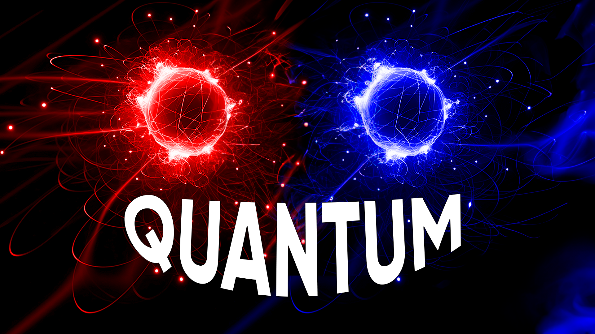
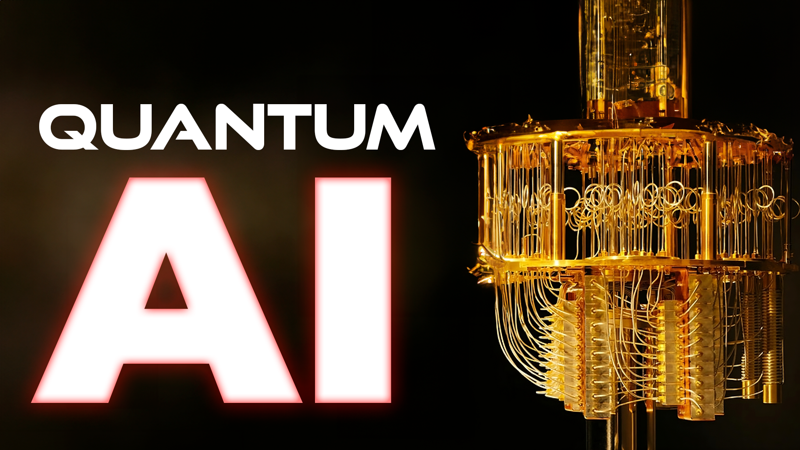
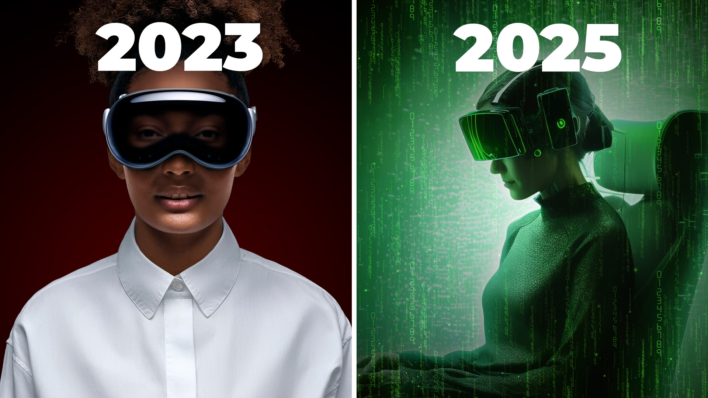
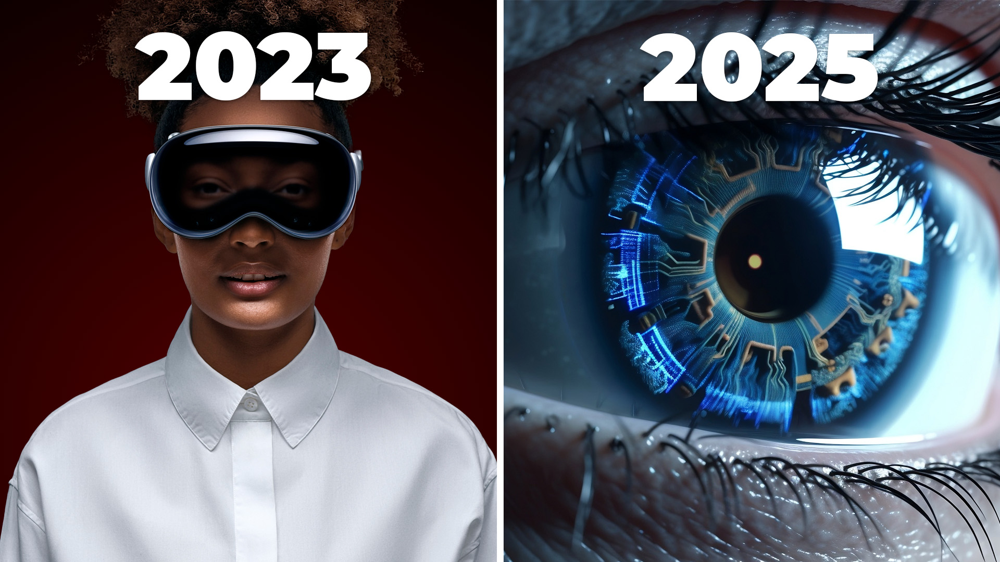
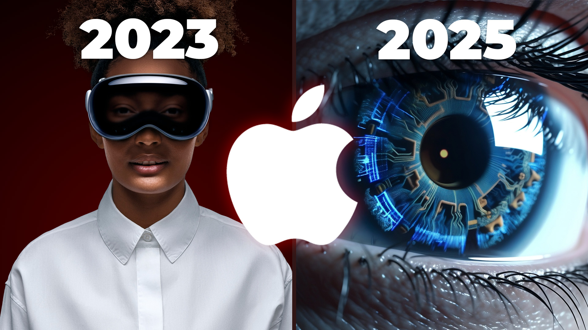

- ## Apple Vision Pro
  id:: 6480eb62-2f19-4b94-9e27-019bbf5d3324
	- tags:: [[Mindful Machines]]
	  type:: video
	  published:: true
	- ### Concept
		- The universe is a computer. Computing is the fundamental property of the universe.
			- It will discuss quantum computing, reversible computing, and how AI can complement those things.
	- ### Thumbnail
		- 
		- 
		- 
		- {:height 412, :width 718}
		- 
			-
			-
	- ### Title
		- How AI Will HARNESS the Quantum Computing Revolution
		- How AI Will Become Superintelligent
		- The Perfect STORM of Computing Revolutions
		- Are You Ready to LIVE in VR?
		- The One Machine to RULE Them All
			- thumbnail change to
	- ### Script
		- #### Brainstorming
			- ((6480ec4d-8353-429f-8d78-3ad0e4f62300))
			- If the universe is a computer and reversible computing is the future, does that mean our past is our future?
			- Are we just in a a loop?
			- Is time a flat circle?
		- #### Hook
			- The release of Apple's Vision Pro marks the dawn of a new era that will dramatically change the way we work, live, and relate to each other. And this is just the beginning.
				- B-roll of youtubers gushing over the thing
					- Clip: Marques brownlee, "series 0. best I've tried"
			- At their annual developer conference in June, Apple announced their entry into the VR headset wars promising the merging of our digital lives with the physical world, or as they're calling it: Spatial Computing.
			- And when you combine this spatial computing with recent breakthroughs in AI, the boundary between the virtual and physical worlds is not just blurred, but completely erased.
			- There is a future very near to us where the worlds we find meaning in don't actually reflect reality anymore. When anyone can live the experience of their favorite stories as if they are actually there, why would anyone want to ever take the headset off?
		- #### The Power of Stories
			- Just like the social media revolution of the 2000s and 2010s that came before it, Apple's vision for the future exploits something fundamental about human nature: our innate ability to relate to each other through stories and emotional connection.
			- Since the dawn of civilization, stories have been the lifeblood of our culture. Our ancestors huddled around fires, sharing tales of gods and monsters, heroes and villains, love and loss. These stories are more than entertainment; they are the threads that weave the fabric of our society - the shared experiences that bind us all together.
			- And this ability to understand and create meaning in stories is hard-wired into us.
				- It's the reason that mnemonics devices like the Story Method work. This technique leverages our innate ability to remember narratives more effectively than isolated facts. It involves weaving information into a coherent and often vivid narrative, making it easier to recall later.
					- For instance, if you were trying to remember a grocery list, you might imagine a story where an apple falls in love with a banana, but the apple's parents - a loaf of bread and a carton of milk - do not approve. It's absurd, doesn't make any sense, but you'll probably remember it.
						- clip: guy who memorized pi
					- This method works because it relies on the profound impact stories have on our cognition. They are fundamental to how we process and remember information. Our brains are wired to think in narratives, to understand the world around us as a series of interconnected events with causes and effects, heroes and villains, beginnings and endings.
			- But beyond this cognitive power, stories hold a deeper, more visceral sway over us. They have the ability to stir our emotions, to make us laugh and cry, to inspire us and move us in profound ways.
				- The emotional impact of the stories we tell is what sears them into our minds.
				- And the more realistic our experience of a story, the more we can suspend our disbelief and the stronger an impact a story will have over us.
		- #### The Night is Dark and Full of Terrors
			- The dawn of AI adds an intriguing layer to this new technology. AI can not only create smarter devices and more efficient systems, but in the context of AR and storytelling, it has the potential to breathe life into our narratives, to create characters that respond and adapt in real time, making our stories not just immersive, but highly interactive.
				- And also, probably more importantly, highly addictive.
			- We live in a world where our phones expertly hack our dopamine reward system to keep us addicted to these handheld black mirrors.
				- *Chad holds up phone. Sound effect of notification sound. "Oh shit, hold on". He begins to scroll his phone.*
			- By combining AI with AR, we will harness the power of stories to shape our experiences and memories in unprecedented ways, ultimately redefining our perception of reality.
			- Unreal Engine recently released a demo showcasing the future of video games, where players can interact with non-player characters (NPCs) powered by generative AI using natural language.
				- This is more than just a leap in photorealism; it's a revolution in how we engage with virtual worlds. Imagine having a natural conversation with a virtual character that not only looks human but also responds and behaves like one.
				- Combining that with augmented reality, where you feel like you are in the same room with this character, yields a level of immersion that has profound implications for our society.
				- It raises the question: what happens when we can potentially relate more deeply and emotionally to non-humans in a virtual world than the real people in our lives?
					- inception clip, dreaming more real to them now
			- Just as social media has paradoxically isolated us from each other, technology now offers a solution to this problem: virtual companionship.
				- A plethora of startups and even open-source projects are now offering the opportunity to interact and roleplay with your own 'virtual companion'.
					- You can video chat, voice chat, or even have a text conversation with it throughout the day.
				- But when you add the layer of virtual reality to this, the possibilities become truly endless. Imagine sharing a meal with your virtual companion, or walking through a virtual park together.
					- Clip: blade runner being served dinner by AI girlfriend
				- These experiences could feel as real and meaningful as interactions in the physical world, challenging our understanding of companionship and emotional connection.
		- #### The Universe is a Computer
			- But if you are only looking at what's possible right now, you are missing a huge part of the picture.
			- We are currently living through an exponential increase in the pace of technological development. Given that, it seems inevitable that we will be able to create a virtual world in the near future that is indistinguishable from reality.
				- Elon Musk's Neuralink is starting human trials this month on brain-to-computer interfaces. This technology aims to create a seamless connection between our brains and computers, potentially allowing us to experience virtual realities as if they were our own physical world. Imagine not just seeing and hearing a virtual world, but also feeling and interacting with it as if it were real.
					- neuralink b-roll glitching to matrix plug scene
			- Once we are able to directly hijack our senses at the brain-level, it becomes pertinent to ask the question, "have we been here before?"
				- Matrix clip: "have you ever had a dream that felt so real? how do you know the difference between the real world and the dream world?"
			- The nobel prize in physics for 2023 was awarded to three physicists who proved that the universe isn't locally real.
				- https://www.scientificamerican.com/article/the-universe-is-not-locally-real-and-the-physics-nobel-prize-winners-proved-it/
				- What does that mean though? "Real" in this sense means that objects have definite, objective properties independent of observation. This is the view that Einstein held when he famously said "god doesn't play dice with the universe"
					- But in our reality, the evidence shows that objects don't actually have those properties unless they are being observed.
				- In other words, our universe, just like a video game, only renders things we are looking at. Video games do this to save resources. Our universe does this to...well, we don't really know why it does this.
			- The most infamous scientific experiment that shows this is the double-slit experiment.
				- Light can either act as a wave or a particle depending on context. This is a fundamental concept in quantum mechanics known as wave-particle duality.
				- The gist of it is you fire particles (photons or electrons) toward a barrier with two slits. Behind the barrier is a detection screen that records the impact of the particles.
				- If you close one of the slits, the particles act like you'd expect forming a single band of impacts on the detector.
				- If you open both slits, still firing particles one-by-one, something strange happens. An interference pattern appears on the detector like you'd expect from waves interfering with each other.
					- But this means, that the single particles you are firing are somehow going through both slits at once like a wave would and interfering with itself.
					- So, let's get to the bottom of this, you decide. You place another detector at the slits to see which one the particle goes through to produce this interference pattern.
						- But when you do this, the interference pattern disappears.
						- It's as if the particles "know" they are being watched and decide to behave like particles again.
				- These results illustrate the concept of quantum superposition which says that a particle can be in multiple states at the same time until it is observed and the superposition collapses into reality.
				- This experiment has been tested and confirmed many times over the years in many different ways. It's why quantum mechanics is sometimes referred to as the most successful theory in the history of science.
					- Despite how counterintuitive it is and the many attempts of the smartest people in the world to prove it wrong, it still holds up.
			- More recent ideas explain this by proposing computing, instead of the 4 dimensional space-time we are all used to, is a fundamental property of the universe.
				- This means that the universe itself might operate like a giant quantum computer, processing information at the most fundamental level.
				- If this is true, it could open up new possibilities for understanding the nature of reality and the potential of virtual worlds.
					- clip: Neil Gershenfeld, lex fridman
		- #### What is Real?
			- So, do we live in a giant video game?
				- Maybe our future self- the consciousness that is the combination of humanity and machine - wants to experience what it was like to live through the Dawn of AI.
					- It wants to experience the story of humantiy and the birth of the singularity.
					- Because after all, stories are what drive us. Stories are what give us our sense of continuity. The story of us - our past and our future - ultimately grant us our sense of self.
			- Or maybe we are just artifacts in a universal simulation that is trying to compute...something. And we accidentally became self-aware. Oops.
				- rick/morty clip about universe car battery where the third universe guy explains it
			- Or maybe this is the first time we've been here. Maybe this is base reality and the Apple Vision Pro is the first step in creating the Matrix.
			- When you start to make unfalsifiable claims like this, you are venturing out of the field of science. Can we ever hope to pierce the veil of reality and glimpse the true nature of our universe?
				- You may be surprised to find that the answer is yes. And there is some exciting new bleeding-edge physics and mathematical theories developed just in the last couple of years that does exactly that.
					- If you want to learn more about these first baby steps humanity is taking outside the confines of space-time and how AI is helping us get there, you should watch this video next.
			- rick/morty video game life clip
	- ### Video Description
		- In this video, we explore the intersection of technology, storytelling, and reality by delving into the groundbreaking capabilities of Apple's Vision Pro and how it's set to revolutionize our experience of stories. We discuss the power of narratives and how they shape our understanding of the world, and how technology like Augmented Reality (AR) and Artificial Intelligence (AI) are enhancing this experience. We also touch on intriguing concepts from quantum physics and ponder the nature of our universe - could we be living in a simulation? And if so, what does that mean for us? This is a journey through the dawn of AI, the power of stories, and the blurred lines between virtual and physical reality.
		- Music
			- Revelling by Thomas McNeice, April Mackay https://lickd.lnk.to/eBRrc1ID!Mindful+Machines
			  Into The Unknown by Julian Emery, James Hockley, Adam Noble
			  Building Suspense by Philip Guyler
			  Mount Everest by Labrinth
			  
			  License ID: aGrj1OdqgJb
			  License ID: NLp6ejgarGJ
			  License ID: PJgbnkm9gnb
			  License ID: 7w91ebzl9K2
			  
			  Get over 1M + mainstream tracks here https://go.lickd.co/Music
	- ### Result
		- {{video https://youtu.be/31Bu4qw7f6Q}}
- How is quantum computing related to reversible computing? #questions
  id:: 6480ec4d-8353-429f-8d78-3ad0e4f62300