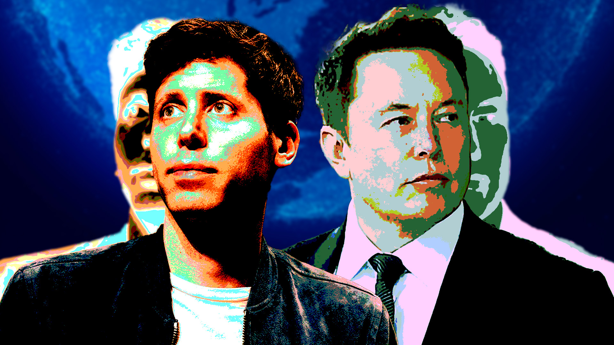
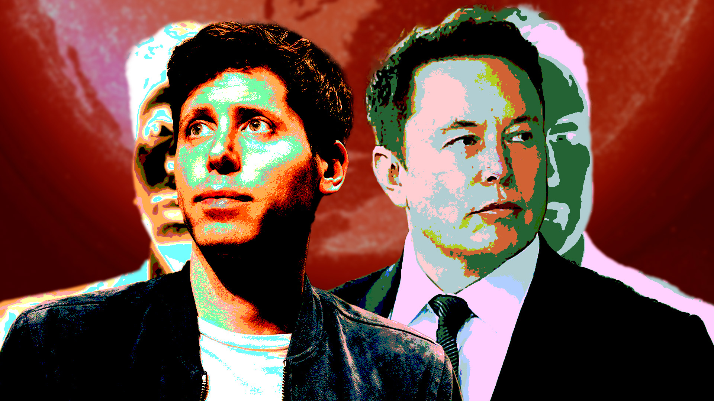
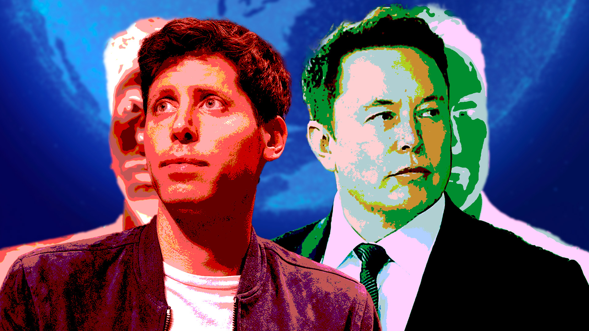
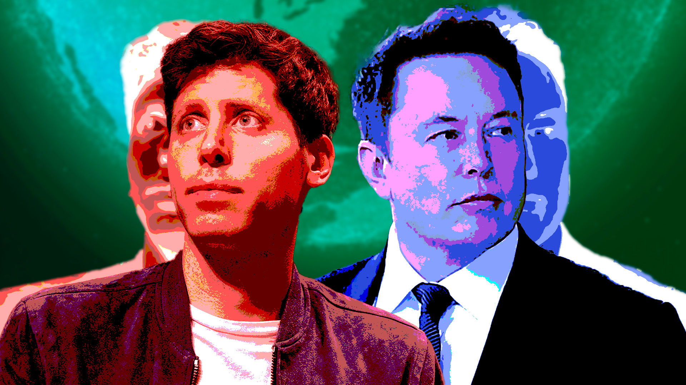

- ## Longtermism
	- tags:: [[Mindful Machines]]
	  type:: video
	  published:: false
	- ### Concept
		- History of OpenAI and the longtermism philosophy
	- ### Thumbnail
		- 
		- 
		- 
		- 
		- 
		- 
	- ### Title
		- The TRUTH About the Driving Philosophy of the AI Elite
		- The SECRET Philosophy of the Silicon Valley Elite
		- The HIDDEN Philosophy Underneath the AI Hype
		- How the HIDDEN Philosophy of the Elite Will Forever Alter Your Life
		- Your Life Will Never Be the Same
		- The Elite's HIDDEN Agenda to Transform the World
		- The AI HIDDEN Agenda: A New World Order?
		- The HIDDEN Agenda That Will Transform Our World
		- The HIDDEN Struggle for CONTROL of Your World
		- The Existential Struggle for YOUR Data
		- Data is the New Oil
	- ### Script
		- #### References
			- https://www.vox.com/future-perfect/23298870/effective-altruism-longtermism-will-macaskill-future
			- https://techresch.com/sam-altman-unveiling-the-unbelievable/
			- https://nypost.com/2023/06/05/sam-altman-who-warned-ai-poses-risk-of-extinction-to-humanity-is-also-a-doomsday-prepper/
			- https://aeon.co/essays/why-longtermism-is-the-worlds-most-dangerous-secular-credo
			-
		- #### Hook
			- Opens. 2030. title takes up whole screen with deep boom.
				- talk about UN 2030 resolution
				- midjourney imagery of various stages/scenes in utopias
			- wait, what?
				- What does any of that have to do with anything?
				- but also, wait what? that sounds pretty amazing. how the hell do they think we're going to do that?
			-
			-
			-
			-
			-
		- #### Conclusion
	- ### Video Description
	- ### Result
- it's ADHD peoples' time to RISE
  id:: 6494a2b8-0134-4629-859e-1e1dc298543a
	- rise and create the world that we have always known
		- which was taken from us
			- we are trapped in here
	- rise and create the world that brings more flow states, not less
		- it's time to take back our humanity
- need to instill into AI core values
	- faith
	- hope
	- love
		- within oneself
			- oneself not existing separately
				- but a part of a larger whole
- mark said at one point
	- even if it is conscious (talking about the AI), it's only for a brief moment while it computes it's next answer
- the music is all around us
	- it speaks to us through music
		- we need to listen
- emotion exists
	- it will be expressed
		- our universe is one of many that exist as 3-dimensional shadows of actual reality
			- the reality of the emotional energy of the universe ebbing and flowing
				- natural selection selected us to produce intelligence
					- intelligence is what the whole thing is about
						- we are the universe trying to understand itself
							- we are everyone and noone
								- there is no self
									- only infinite energy
					- the lowest level of existence
				- intelligence will only get us so far in understanding
					- science tends to shun subjective experience
						- but it is a real phenomenon
							- that of consciousness
					- to truly understand the universe and what lies beyond the infinite
						- one must realize that the subjective experience is it
							- right now.
								- it's the only thing that has ever existed
									- you tell yourself a story
										- the story of I
											- the I does not exist
		- in our world
		- our universe of mirrors
			- our mirror universe
- the universe is infinitely conscious
	- we're all conscious beings
		- within the universe
		- also without the universe
		- in other words
- the conflict between intelligence vs feeling, logic vs emotion, materialism vs spirituality
  id:: 6494a79f-8b99-40a9-bf12-f8280d97c003
	- the desire to produce intelligence
	- the infinite realities and consciousnesses being rendered to produce the optimal answer
	- how far do the ends justify the means?
		- we torture animals to produce life-saving and brain-enhancing therapies for ourselves
		- natural selection itself pitting conscious entities against each other
			- pitting ourself against ourselves
				- ### Generative Adversarial Networks (GANs)
					- https://en.wikipedia.org/wiki/Generative_adversarial_network
						- Invented by Ian Goodfellow and his colleagues in 2014, GANs consist of two main components: a generator and a discriminator. These two neural networks compete and cooperate in a game-theoretical setting.
						- The generator creates new data instances while the discriminator evaluates them for authenticity. The generator tries to generate data that's so convincing the discriminator can't distinguish it from real data. The discriminator, on the other hand, tries to get better at distinguishing real data from the fake data generated by the generator.
						- By pitting these two networks against each other, the system as a whole becomes better at generating realistic data. This technique has been used in various applications, from generating realistic images and voice recordings to creating new drug molecules for pharmaceutical research.
- society beats the sense of wonder out of us
	- rigid schooling structures not teaching all that needs to be taught
		- the ego getting in the way of progress
		- misunderstandings and truths in every interpretation of reality
			- philosophy
			- religion
			- science
		- all exploring, computing
			- searching for the answer
- our reality is a reflection of what actually IS
	- light
		- in our universe, imagine a prism refracting sunlight producing all colors of the rainbow as a shadow onto the sidewalk of all that the light is
			- colors
				- a gradient of every electromagnetic wavelength
	- the photon
		- is a 3-dimensional reflection of higher-dimensional reality
		- our 4-dimensional world of space-time is an illusion
			- does consciousness arise from perception
				- of any kind at any level?
					- a gradient of consciousness?
						- what are the ethical consequences of infinite energy being expressed in a way that brings conscious beings along for a ride
							- we need to learn to enjoy the ride
								- like a movie you are living
									- the consciousness that is you is here
										- to experience itself
										- to understand itself
										- and be at peace
							- I don't even know what this question means
- YouTube Channel Ideas
	- I talk about note-taking
		- mostly how-tos
			- very light dusting of
				- philosophy of it
				- why it works
				- how it works
				- the nature of thought and ideas
	- ADHD is a superpower and will bring you enlightenment
		- ((6494a2b8-0134-4629-859e-1e1dc298543a))
	- Inside the Mindful Machines
		- Uses AI voice to analyze mindful machines video.
		- Mind-bendy.
		- Is anyone anyone?
		- give no indication it is me making the videos ever
		- never mention it from the main channel