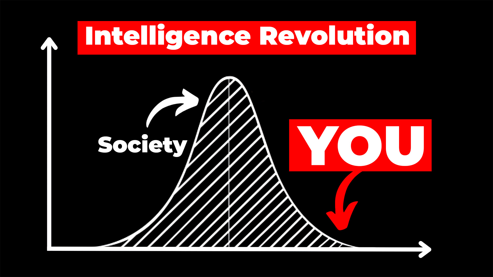
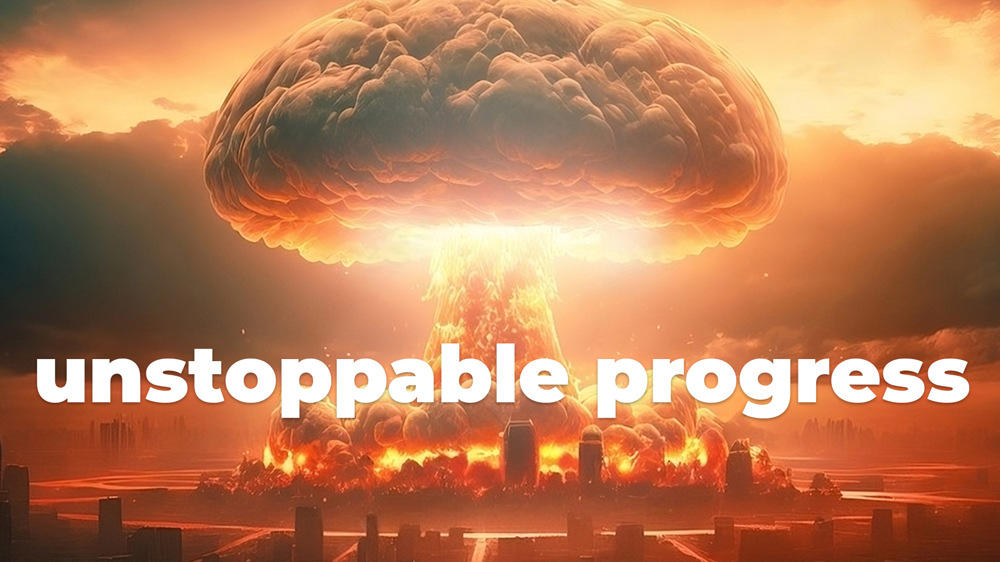
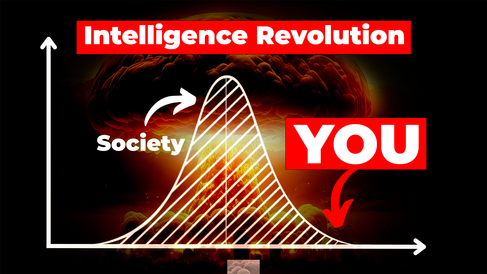
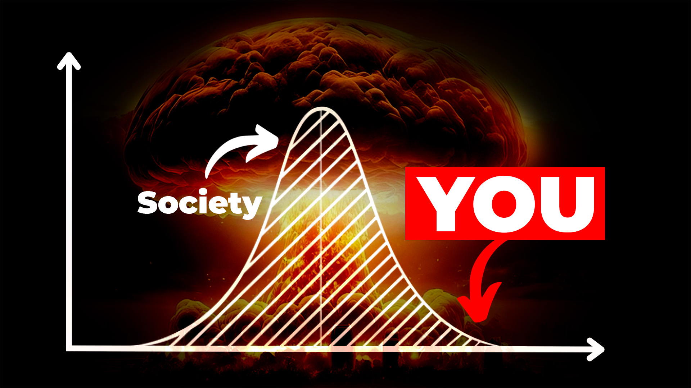
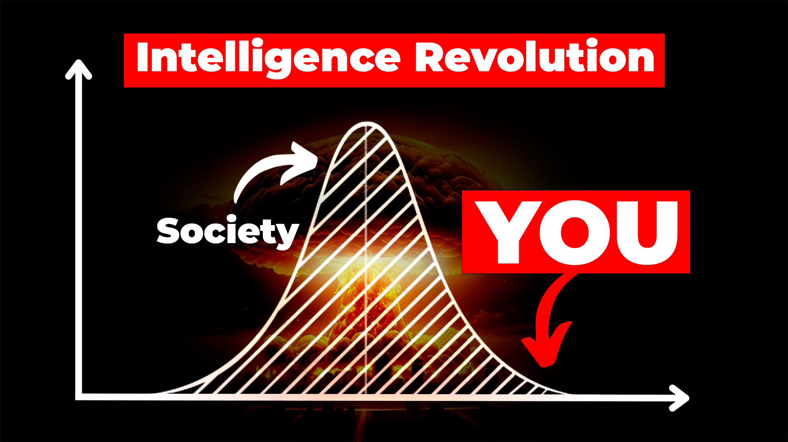
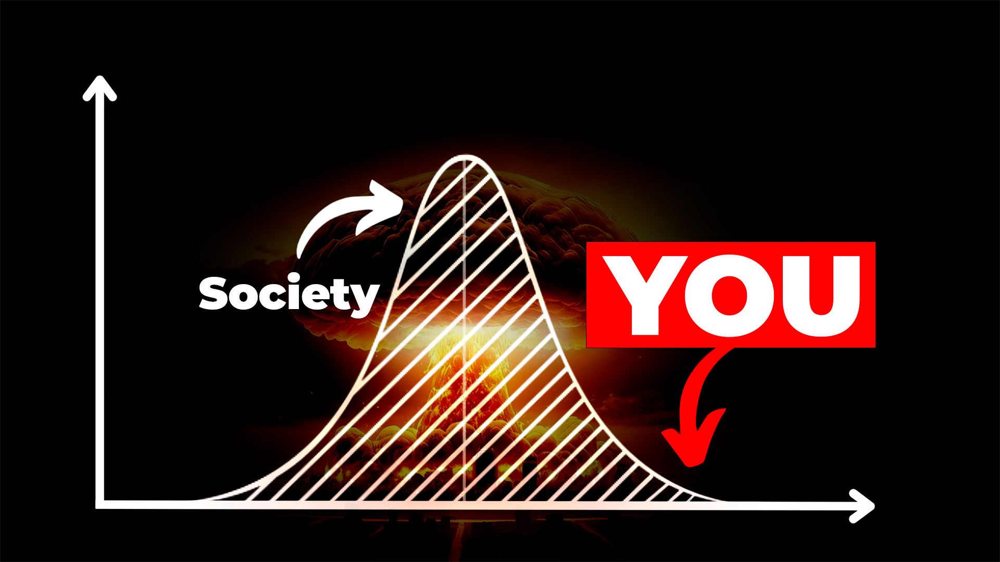
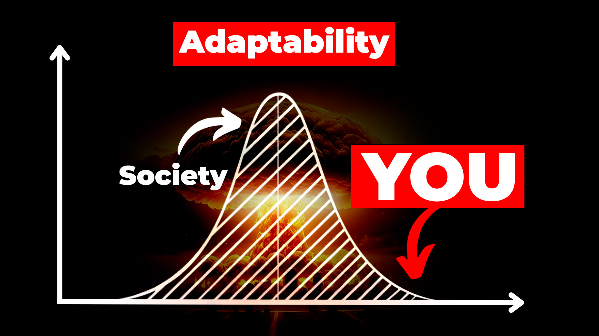
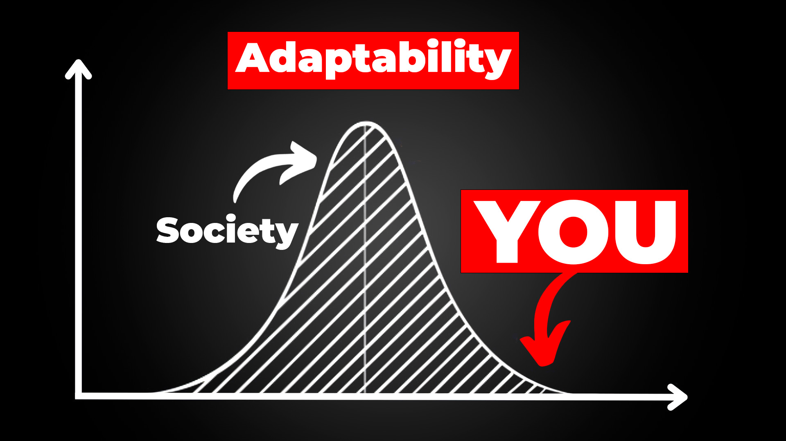
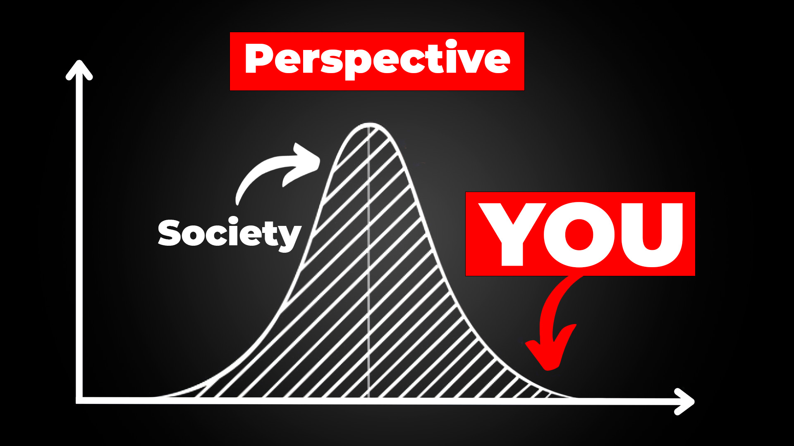

- ## A Harmless Man is Not a Good Man
  id:: 649bbe62-5be9-45ad-8fd5-2a8fcf71ffad
	- {{video https://www.youtube.com/watch?v=u6gqNTtuMU8&t=162}}
	- Knowing your own darkness necessarily entails wallowing in it, swimming with it, being present in the deep, dark bowels of your subconscious and emotions. I take issue with the characterization of control. Wisdom comes from knowing you cannot control the monster within you. It is a part of you and needs to be understood, experienced, and channeled - not controlled, not judged, not locked away.
	- {{youtube-timestamp 39}} *if you are not capable of cruelty, you are absolutely a victim to anyone who is*
	- {{youtube-timestamp 68}} when you realize you are seriously dangerous, you demand that you treat yourself with respect and others do the same
	- {{youtube-timestamp 159}} *No tree can grow to heaven unless its roots reach down to hell.*
		- Knowing your own darkness is the **best method** of dealing with the darkness of other people.
		- Hell is the place where the person you are meets the person you could have been.
	- {{youtube-timestamp 198}} The most evil in society are **just like you**.
	- {{youtube-timestamp 231}} The path to enlightenment is a matter of **facing the thing you least want to face**.
- ## AI Apocalypse
	- tags:: [[Mindful Machines]]
	  type:: video
	  published:: true
	- ### Concept
		- Make the case for the death of capitalism
			- Moloch
			- perverse incentives
			- ((649ec4a1-8804-4c40-8e04-5bfbe4adf1f3))
		- the importance of thinking for yourself
			- getting comfortable with the idea of the unknown
			- ((649ec38d-c1ae-4364-9028-575f827c1e29))
			- ((649ec021-1ddf-4f69-85fc-994427ce99ce))
	- ### Thumbnail
		- 
		- 
		- 
		- 
		- 
		- 
		- 
		- 
		- 
		- 
	- ### Title
		- How to SURVIVE the AI Revolution
		- How to SURVIVE the AI Apocalypse
		- How to SURVIVE AI's Unstoppable Progress
		- What to EXPECT in the AI Revolution
		- What You NEED to Understand to Thrive in Our Future
		- What You NEED to Understand About the Future
		- How to Survive the AI Hype Cycle
		- You Need to Act NOW to Thrive in the AI Revolution
	- ### Script
	  id:: 75f77d1c-8ae5-445d-a706-8301cb3b6045
		- #### Hook (30s trailer for the entire video)
			- 2023 is proving to be an inflection point in human history as science produces breakthroughs with the potential to reshape our everyday reality in unprecedented ways.
				- ((649ebb7c-b5dd-4919-95a1-142d9a82669a))
			- And that relentless march of progress is accelerating, with each breakthrough fueling the next, creating a compounding effect of rapid advancement.
				- b-roll of [graph animation](https://towardsdatascience.com/parameter-counts-in-machine-learning-a312dc4753d0)
			- But what does this all mean?
			- Are we headed toward a utopia? A dystopia? Or is all of this just a bunch of hype?
			- And what should YOU be doing about it? How can you prepare for this wild, uncertain ride into the future?
		- #### Hook 2 (1m trailer for the entire video that goes a tiny bit more in depth on each point)
			- When we talk about transformative AI, we are not talking about narrow AI systems like self-driving cars in the ancient past.
				- b-roll of self-driving cars with date of 2018
			- We are talking about generative AI - the kind of AI that can generate human-like text, create unique digital images and video, and even compose music.
			- But really, the driving force behind all the excitement, terror, and suspense is the humble large language model. This is the kind of AI that is already starting to show signs of AGI.
				- graphic of strong vs weak AI and AGI definitions
			- This is the one that can control the other AIs and has the potential to fundamentally reshape our daily lives, our economy, and even our very identity and what it means to be human.
				- [virtual girlfriend tiktok article](https://futurism.com/influencer-ai-girlfriend-rent)
		- #### The Dawn of AI
			- Before we get into the specifics of what you can do right now to stay ahead of the curve, you have to understand where we are right now.
			- Google's up-and-coming AI system, Gemini, currently in training as of July 2023, is on track to outperform GPT-4 - OpenAI's model that has awakened the world to the profound capabilities of large language models (LLMs)
			- ((649ebb1b-d9a5-426e-b5d8-4f31882682d3))
				- > Nexus of insanity, money, data, science. It's all coming together.
			- There's a future coming at us very fast. But what kind?
			- A peek into the AI systems presently in widespread use, like those driving social media algorithms, can offer us some insight. Their underlying objective - or "goal function" in AI jargon - is to maximize your time spent on their platform.
			- And like all machine learning algorithms, it does an incredible job of optimizing that metric.
			- The problem is, it learned that it can do that very effectively by promoting highly emotionally engaging content - especially negative emotions that divide us into tribes. That is really effective at getting people to watch and engage - mental health of society be damned.
			- But if we just look at the AI itself, we're ignoring a big part of the overall system. The real goal isn't watch time. It's maximization of profits for the corporation that owns the platform: the big tech companies.
			- ((649ec4a1-8804-4c40-8e04-5bfbe4adf1f3))
				- > There is something you get that you didn't have to pay for or the payment is offset to the future or other people
			- In the case of social media, our mental health and attention spans are the real payments for these services.
			- When AI systems don't understand what they are actually doing - when their values aren't aligned with human values - it can lead to massive unintended consequences to the detriment of our society.
			- And as AI grows to be more complex and more capable, what the AI understands and how it achieves its goals start to matter a lot.
			- But I'm not going to start describing a cyberpunk dystopian, 1984 future. Pop culture has done a great job at drilling that narrative into are collective psyche for decades now.
			- I think a better story - and one that gives me much more hope - is one where we all come together and figure out exactly what it is *we* want and how to get the *AI* to want the same thing.
		- #### Worldviews
			- ((64a597a3-983e-448b-922c-4552ba20bece))
			- David Shapiro is an AI researcher, commentator, and YouTuber with 14 years experience in the machine learning field.
			- David is the creator and steward of the GATO Framework which defines a set of heuristic imperatives, which if implemented in an AI system, would ensure that the model's actions align with what humans cares about without unintended consequences.
			- When you start diving into the world of AI, you'll find a few different types of people:
				- the doomers
				- the deniers
				- the optimists
			- Obviously, people are unique snowflakes and don't fit very nicely into little categories like this. But for the sake of this discussion, let's just go with it.
			- Your worldview - your unique perspective - colors the solutions and ideas you come up with for the alignment problem.
			- The doomer's ideas of a solution is to pause development until we have a way to precisely and scientifically prove that an AI has humanity's best interests in mind. This will require a number of breakthroughs in young scientific fields like mechanistic interpretability.
				- https://arxiv.org/abs/2304.14997
				- This solution has a number of trade-offs associated with it, the biggest one in my mind being its lack of solutions to the tragedy of the commons that is ensuring the entire world races ahead to AGI without really knowing what we are doing. Watch this video if you want to dive deeper into that.
			- The deniers, on the other hand, are just gonna keep on doing what they're doing.
			- But the hopeless optimists, the ones who just don't know when to quit. This is the worldview I want to talk about right now. Because, *if* we can solve this problem of alignment - *if* a utopian society is in our future, it is the optimists that will give it to us.
			- ((64a1ad4b-16bc-49d7-adf3-eff835dedeb6))
				- > utopia is loaded term. what does it actually mean? high standard of living, social mobility, individual liberty
			- And to really know what concrete steps you should be taking right now (which we'll get to in a minute), you really *need* to understand how your perspective affects your reality.
			- > Daniel Kohlberg came up with this model of moral development. What he discovered was that humans go through three overarching phases of moral development. So the first phase is what he called pre-conventional morality where you learn not to do something based on consequences. This is what small children do. You do something bad, you get put in timeout.
			  
			  > The second phase is conventional morality which is basically social control. You go along to get along. These are the rules that my social group, my family, the laws of the land - you appeal to law and order. This is where most people get.
			  
			  > But there's a third phase which is called post-conventional morality which are the universal principles that you might eventually arrive at.
		- #### The GATO Framework
			- Out of this complex landscape of differing perspectives and approaches, David Shapiro has proposed an innovative approach: the GATO Framework. This framework, grounded in post-conventional morality offers a set of guiding principles for AI development and use:
				- reduce suffering
				- increase prosperity
				- increase understanding
			- Now you people watching this video, you're smart. You'll notice I said three things, not one.
			- One of the key ideas here is the optimization of multiple goals.
			- ((64a1af40-9a76-42c1-b119-5a9674c97297))
				- > If you give a machine these goals and it's not just one at a time. Because obviously if you say to reduce suffering, the best way to reduce all suffering is to eradicate all life. That's obviously not ideal. Back with GPT-2, one of the first experiments I did was I trained it to reduce suffering and I asked it what to do about chronic pain and it said to euthanize everyone with chronic pain and I said "well, that's not exactly what I meant." And I realized you actually need multiple goals.
			- But, as I alluded to before, the goals of AI systems depend greatly on who controls the system. That's why the GATO framework is built on multiple layers to affect change at each level of our human institutions including taking into account corporate and national interests. Because if we don't change the incentives at those levels, it makes it much more difficult to align goals on the technical level.
		- #### What Now? (3m)
			- So how can you prepare for the great unknown when we don't even know what we don't know.
			- Well, I could tell you things like learn prompt engineering - how to talk to the AI to get it to give you the results you want - which is certainly a valuable skill.
			- But the real answer, like most things in life worth pursuing, is extremely difficult.
			- It's realizing that there is no curve to get ahead of here. We're all in this together.
			- If humanity survives this century with an outcome we view as desirable, it will only be because we found a way to work together and trust each other in a world where no one can be trusted.
			- The challenges AI poses require expertise in all kinds of fields like psychology, neuroscience, computer science, and even things like communication studies to name a few.
			- Facing such extreme challenges can feel very daunting.
			- How can a single drop in a vast ocean make any sort of difference?
			- The first step is realizing, you are not a drop. When we work together, we are the ocean. And we can move mountains.
			- And to fully answer the question posed at the start of this video, if you really want to survive the intelligence revolution, you need to wake up and participate in the creation of our reality, of our future.
			- Be the change you want to see in the world.
			- Check the links in the description for ways you can get involved.
		- #### Democratic AI
			- But how can we all work together - all of humanity - in a systemic way? To understand that, you should watch this video next to learn about Democratic AI and the role decentralization technologies will play in our future.
	- ### Video Description
		- Dive deep into the tidal wave of advancements in artificial intelligence and their potential impact on our everyday lives. This video unpacks the complexities of AI, from its current state to diverse perspectives about its future. Join us as we delve into the groundbreaking GATO framework for AI alignment and explore what you can do to prepare for this technological revolution. In a world where we're increasingly intertwined with AI, how can we ensure our survival and success? Together, let's awaken to the realities of our future and become active participants in shaping it.
		-
		- References
			- The GATO Framework
			  https://www.gatoframework.org/
			-
			- Full Interview with David Shapiro by Riley Brown
			  https://youtu.be/Hxv3MmXLaW0
			-
			- Large Language Models Can Self-Improve
			  https://arxiv.org/abs/2210.11610
			-
			- Sparks of Artificial General Intelligence: Early experiments with GPT-4
			  https://arxiv.org/abs/2303.12712
			-
			- Refining the Responses of LLMs by Themselves
			  https://arxiv.org/abs/2305.04039
			-
			- The first fully A.I.-generated drug enters clinical trials in human patients
			  https://www.cnbc.com/2023/06/29/ai-generated-drug-begins-clinical-trials-in-human-patients.html
			-
			- Scientists Use AI to Discover 'Ghost Particles' From Our Own Galaxy In First
			  https://www.vice.com/en/article/pkak3b/scientists-use-ai-to-discover-ghost-particles-from-our-own-galaxy-in-first
			-
			- How AI may help humans "talk" to animals
			  https://www.axios.com/2023/07/01/ai-humans-talk-animals-research
			-
			- Parameter counts in Machine Learning
			  https://towardsdatascience.com/parameter-counts-in-machine-learning-a312dc4753d0
			-
			- HuggingGPT: Solving AI Tasks with ChatGPT and its Friends in Hugging Face
			  https://arxiv.org/abs/2303.17580
			-
			- Influencer Creates AI Version of Herself That You Can Rent as a Girlfriend
			  https://futurism.com/influencer-ai-girlfriend-rent
			-
			- Technology’s role in the ‘loneliness epidemic’
			  https://www.washingtonpost.com/technology/2023/04/11/technology-loneliness-role/
			-
			- LongNet: Scaling Transformers to 1,000,000,000 Tokens
			  https://arxiv.org/abs/2307.02486
			-
			- Mechanistic Interpretability Research
			  https://arxiv.org/abs/2304.14997
			-
			- AI 'prompt engineer' jobs can pay up to $375,000
			  https://www.businessinsider.com/ai-prompt-engineer-jobs-pay-salary-requirements-no-tech-background-2023-3
		-
		- Music
			- Emotional Virus by John 00 Fleming
			- Into The Unknown by Julian Emery, James Hockley, Adam Noble
			- Synchronicity 10 by Joe Henson, Alexis Smith
			- Synthetic Life 6 by Julian Emery, James Hockley, Adam Noble
			- Mindset by Alex Arcoleo
			- Machines Are My Only Friends by Luke Richards
			-
			- Get over 1M + mainstream tracks here https://go.lickd.co/Music
			- License ID: RxpADKEvYW3
			  License ID: NLp6ejgarGJ
			  License ID: VNDJZOexDg7
			  License ID: GN4jWEgM31J
			  License ID: 1aqZQd6LPLB
			  License ID: qEdzz3NXdYN
	- ### Result
		- {{video https://youtu.be/F2KUtha3vTU}}
		- ### Comment
			- *If your unique worldview colors the solutions and ideas you come up with for the alignment problem, you're no longer doing science. We don't have AGI and we have no idea how to get to it. I don't see an existential alignment problem. There are alignment problems to be sure, societal and economic both but AI isn't coming to kill us so far as any of us know.*
				- I hope you find your way back here when you're ready to hear the truth.
				- *What truth is that? I've been obsessing over this topic for almost my whole life. I'd love to hear what truth you think I'm unaware of. I'm interested in testable hypothesis and reasonable projections. There are none in this vein to date. If you're not contributing anything substantive, don't pretend like you are by telling me I'm not ready to "Hear the truth" (Which I'm certain you don't have) while saying nothing of it.*
				- The truths we least want to see are the ones staring us in the face.
				  Good luck to you.
				- That seemed like a patronizing platitude, but please give me one more shot at this, because this is more important than I think you realize, and people need to understand.
				  
				  Though I wish AI were at the level suggested, there's no such thing staring us in the face that anyone can point to. That's the first thing, and it's VERY dangerous to humanity to suggest we're at this place if we're not.
				  
				  Large Language Models don't pose an existential risk, and there's nothing scientific that suggests they can or will in the future - only science-fiction. If there were, I would then say it was "Staring us in the face," but it's not, so I don't, and neither should anyone else. I'll tell you why but first...
				  
				  This isn't an opinion I have. It's the stone-cold truth of the matter. To believe we face an existential threat from our AI is, at this point itself a non-fact-based opinion largely being driven by the same algorithms that love to divide us for ad revenue. That's also a fact we know. Look at the engagement it's just drummed-up between us. It will continue to recommend these.
				  
				  How many videos have you seen from the opposing side? I have to seek them out specifically through search but they do exist. They're the most thoughtful, well-reasoned, science-based analysis of the situation you will find. I highly recommend them.
				  
				  To be honest, I half-wish our models were as powerful as the youtube algorithm suggests, or that they had characteristics that could lead to it, but it's just not happening. Not with anything we have now or know of being planned, at least. Videos like this are only based on what we can imagine some unknowable model at some point might be able to do.
				  
				  AI is my life's work, man. If we were there or obviously had it on the horizon, I would be spending all my time on AGI safety. I don't because it's futile without at least having a hypothetical path to AGI. The worst of it is as follows...
				  
				  It's harmful and extremely dangerous to recommend regulating intelligence on the back of such an unscientific opinion. Do this: Forecast what the world will be like if a handful of mega-corporations, military, and governments have 10,000x more intelligence than everyone else is allowed to have access to. It's unconscionable. It's dystopian, and it can't be allowed to happen.
				  
				  It's also dangerous for AI/AGI safety to have a centralized point of regulatory failure, though that's a moot-point when we don't even have a path to facing that danger to begin with. We know we face the danger of enormous power-grabs the likes of which the world has never seen.
				  
				  Right now and for the foreseeable future, we face immense danger of humans centralizing and hording intelligence more than anything else AI could theoretically do on its own.
				  
				  We have solutions for this. They are: Open-source, democracy, decentralization, and free-markets. Those things that have uplifted our civilization are under threat right now of humans regulating the intelligence of others in the name of AI safety.
				  To be clear, I don't mean that democratic AI is under threat. I mean democracy itself and everything we enjoy are under threat if we allow the regulation of our intelligence in the name of safety. It will undo civilization as we know it, for better or worse. I fear the worse is regulated intelligence and the better is everyone being uplifted all-at-once - that we will head for the worse by way of the revenue-seeking algorithms, monopolizing corporations, and power-seeking governments.
				- I appreciate you taking the time to explain the nuance of your comment and continuing to make your point despite the perceived shortness on my part.
				  
				  If you were to meet me in real life, you would learn how I can come across as an asshole...like most of the time. It's not on purpose, but I talk very quickly and assume people understand things in my head that I shouldn't assume. This leads me to try to talk very concisely and accurately - which usually just ends up as sounding cryptic.
				  
				  I'm going to try and explain what I meant and how my mind arrived at what I said from reading your comment.
				  
				  I'm not sure how much of the video you watched (or how well I made my points in the video), but I think we agree on almost all of the points you made here.
				  
				  The part of your comment that jumped out and screamed at me was the phrase "you're no longer doing science" and I'm realizing now how my perception shaped everything that happened next. In other words, the thoughts I was already thinking about myself affected how I read your comment and focused my attention like a filter. Or like I say in the video, my unique thoughts and worldview affected how I received and understood your comment.
				  
				  I've grown up valuing science and objectiveness over unfalsifiable ideas. It is definitely a part of the core identity that I've created for myself. But, I think what I'm coming to realize and understand about myself and my world is the same revolution that is happening in physics right now.
				  
				  The reason we never arrived at a "Theory of Everything" in the 20th century, IMO, is the over-reliance on objectivism to understand the universe. And as we reach the limits of what we can understand with quantum mechanics, it's becoming more and more obvious that a true understanding of the universe cannot happen while ignoring subjective experience.
				  
				  Subjective experience is literally how we perceive the world. Even that what we think is objective is completely transformed and manipulated by our minds through our past experiences (through memory) and our future experiences (through imagination). Throw in some emotions and you got yourself a human - one with a unique perception of our shared reality.
				  
				  The "truth" I was referring to was that the subjective perceptions of ourselves and everyone around us affect our world in unseen ways if we aren't aware of and paying attention to it.
				  
				  Focusing specifically on the last paragraph of your comment, I completely 100% agree with your points and definitely see the ease at which we can slip into a dystopia with the way everything is going right now. I think we arrived at the same conclusions but from different perspectives.
				  
				  The core point I was trying to make with the video was: wake up and pay attention. If you just rely on the shared narrative of fear that permeates our society around AGI/ASI, in trying to keep yourself safe, you'll end up in the dystopia that you fear the most.
				  
				  Change your perception and change the world.
- ## Outwork Everyone By Being Bored
  id:: 649c59dc-9bff-419b-bbea-eeb2eccd424b
	- {{video https://youtu.be/1iNyqomXQt8}}
	- {{youtube-timestamp 133}} The ability to perform deep work is becoming increasingly valuable in our economy
	  id:: 649c5536-fd0c-40da-8ce6-6c666629914f
- ## Munk Debate on Artificial Intelligence | Bengio & Tegmark vs. Mitchell & LeCun
  id:: 649d75b2-3b7d-483d-b681-ad615104f565
	- {{video https://youtu.be/144uOfr4SYA}}
		- 00:00 Intro
		- 02:22 Pleasantries
		- 05:12 Debaters
		- 09:42 Audience Voting
		- ### Max Tegmark Opening Statement
			- #### {{youtube-timestamp 818}} Superhuman AI is Different
				- {{youtube-timestamp 893}} Iterative refinement does not work
				- {{youtube-timestamp 928}} Superintelligence
				- {{youtube-timestamp 997}} Why would superintelligence have "bad" goals?
			- #### Possible Routes to Rogue AI
				- {{youtube-timestamp 1077}} Malicious AI usage
				- {{youtube-timestamp 1123}} AI Outcompetes Humans
				- {{youtube-timestamp 1168}} Humans will voluntary give away control to machines that "don't even need us for anything"
		- ### {{youtube-timestamp 1221}} Yann LeCun Opening Statement
			- {{youtube-timestamp 1232}} We are far from human-level AI
			  id:: 649c83ba-3e30-485f-8891-cb6f694b2a21
			- {{youtube-timestamp 1306}} AI can help align AI and keep risks in check
			- {{youtube-timestamp 1315}} engineer is focused on system architecture
			- {{youtube-timestamp 1383}} Objective-Driven AI
			- {{youtube-timestamp 1407}} AI will have emotions and empathy which will make them aligned to "behave properly"
				- {{youtube-timestamp 1424}} We won't be able to achieve human-level intelligence without endowing AI with emotions. "This will be the way to control them."
			- {{youtube-timestamp 1477}} "People, right?"
			- {{youtube-timestamp 1492}} AI should be transparent and open like Wikipedia
				- {{youtube-timestamp 1518}} **If AI is dangerous, it can't be open source**
			- {{youtube-timestamp 1547}} "Being smart is intrinsically good"
			- {{youtube-timestamp 1558}} We will make AI safe with engineering, good ol' fashion elbow grease
		- ### {{youtube-timestamp 1590}} Yoshua Bengio Opening Statement
			- {{youtube-timestamp 1622}} Digital computers vs analog brains is about trade-offs. Not a 2-dimensional scale. refuting ((649c83ba-3e30-485f-8891-cb6f694b2a21))
			- {{youtube-timestamp 1796}} We don't know when we cross the intelligence threshold
			- {{youtube-timestamp 1850}} new entity in the world with possible self-preservation goals
			- {{youtube-timestamp 1896}} Existential risk could also be disempowerment - no longer in control of our destiny
			  id:: 649c8a1b-0690-4bcb-ac12-2e6bec51e785
			- {{youtube-timestamp 1916}} Case for existential risk
		- ### {{youtube-timestamp 1970}} Melanie Mitchell Opening Statement
			- {{youtube-timestamp 2000}} Existential threats are based on unfounded speculation rather than science or empirical evidence
			- {{youtube-timestamp 2032}} The claim of x-risk is itself harmful
			- {{youtube-timestamp 2078}} The far-off future argument. "They aren't alive!"
			- {{youtube-timestamp 2120}} Fallacy of Dumb Superintelligence
				- still thinking of intelligence as a 2-dimensional scale
				- {{youtube-timestamp 2150}} "intelligence is having insight into goals and effect of actions"
					- we wouldn't give control and access to AI without these measures of intelligence
			- {{youtube-timestamp 2199}} argument that "people will get access to information anyway" with or without AI
			- {{youtube-timestamp 2206}} Bureaucracy will save us
			- {{youtube-timestamp 2273}} "Would you call science itself an existential risk?"
		- ### {{youtube-timestamp 2324}} Max Tegmark Rebuttal
			- {{youtube-timestamp 2338}} my claim is not an extraordinary claim, yours is
			- {{youtube-timestamp 2379}} no matter how far off, what's your plan to make it safe?
			- {{youtube-timestamp 2450}} let's get past the slogans and talk nuance
		-