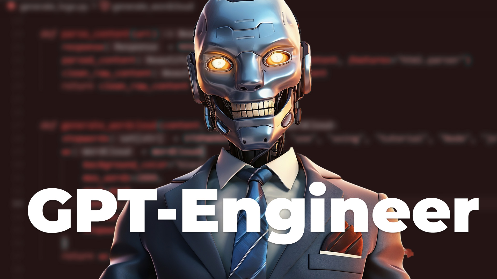
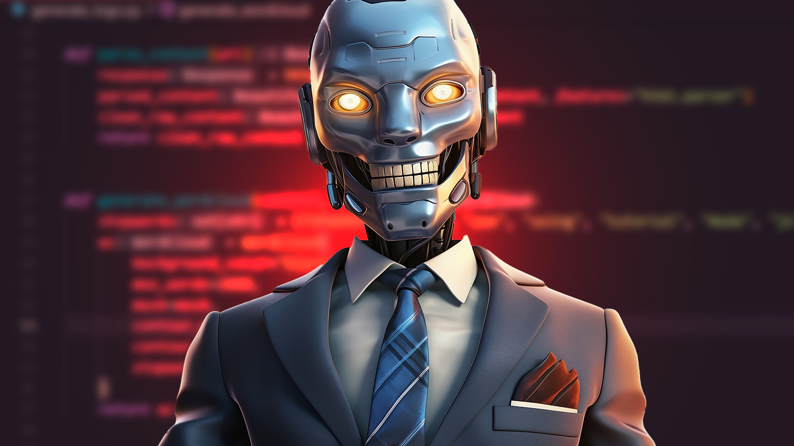

- ## Marcel Livestream
	- tags:: [[Mindful Machines]]
	  type:: video
	  published:: true
	- ### Concept
		- Marcel and I talk about AI, how he's using it, where it's going.
	- ### Thumbnail
		- 
		- 
		- 
	- ### Title
		- How to Build Software in the AI Revolution
		- How to Build Your Own AI Engineer
		- How YOU Can Build Any Software You Need
		- What's Next in the AI Hype Cycle?
	- ### Script
		- #### Hook
			- The Gartner Hype Cycle is the idea that new technology follows a predictable curve of hype until it eventually reaches a point where it becomes useful and integrated into our society.
			- This model suggests that every new technology undergoes a predictable journey from the initial Technology Trigger, through the Peak of Inflated Expectations, into the Trough of Disillusionment, up the Slope of Enlightenment, and finally reaching the Plateau of Productivity.
			- We've seen this cycle play out in the internet and mobile revolutions of the past, but is AI following suit? Or is AI the technology that will buck the trend?
			- Thanks for joining us today whether your watching live or the recording, leave a comment and let us know your thoughts on everything we talk about today.
			- To get a new perspective on all of this, I'm going to be talking to my friend Marcel Mata - an experienced software engineer helping to navigate the future of technology. He also enjoys applying his breadth of knowledge to international relations.
			- If my head is constantly in the clouds, one might say that Marcel is down on the ground in the trenches of capitalism.
			- Welcome Marcel. So before we start prognosticating, I'd really love to get your perspective on what's happening right now - how you and your engineering team are using AI everyday.
		- #### Outline
			- Longnet
				- ADHD. dilated attention. I find this idea so fascinating: it can process more information by focusing on less information.
			- It's a tool. Data. Focusing on the logic or the information.
			- Code plumbers.
			- GPT-Engineer
			- Existential Risk. Overton window. Cultural narrative of fear that AI is an enemy that has to be controlled.
			- Optimistic or pessimistic.
			- Post-nihlism
		- disillusionment. protect yourself. bad actors. memory
	- ### Video Description
	- ### Result